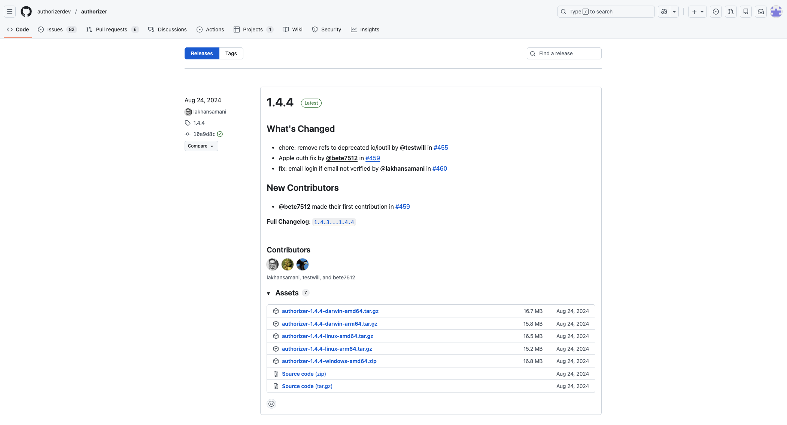
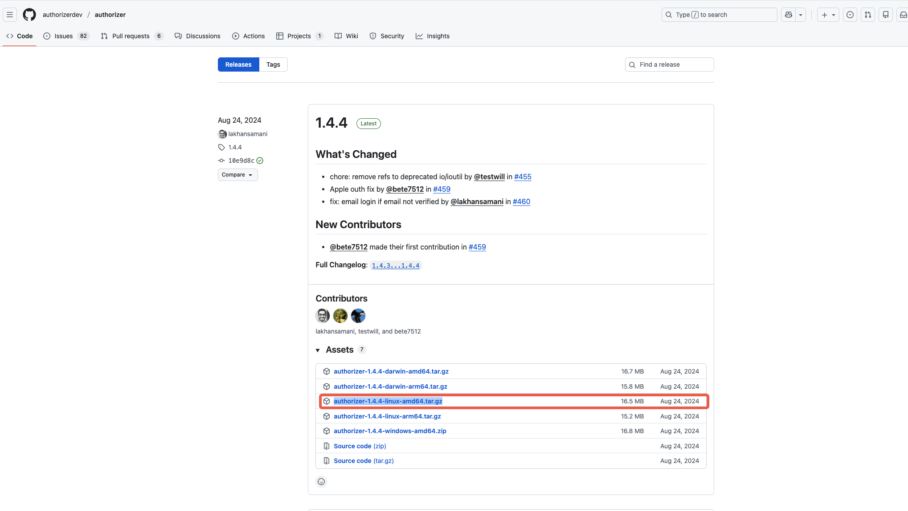
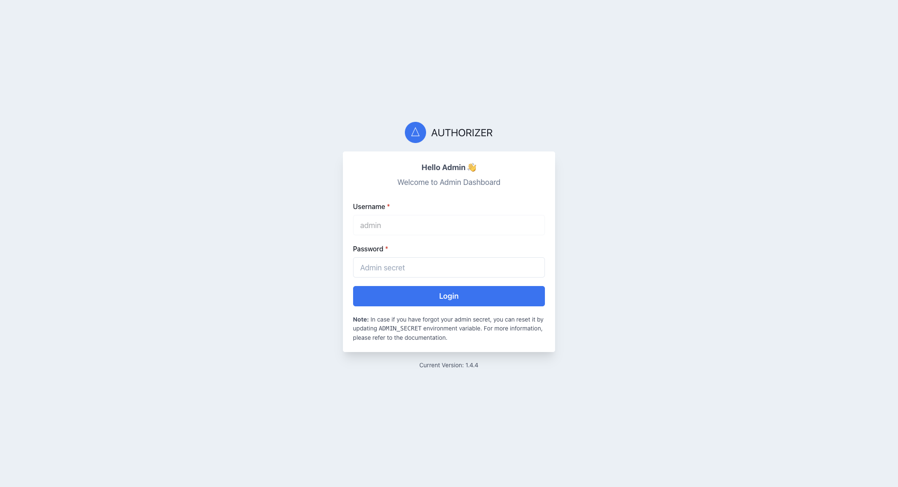
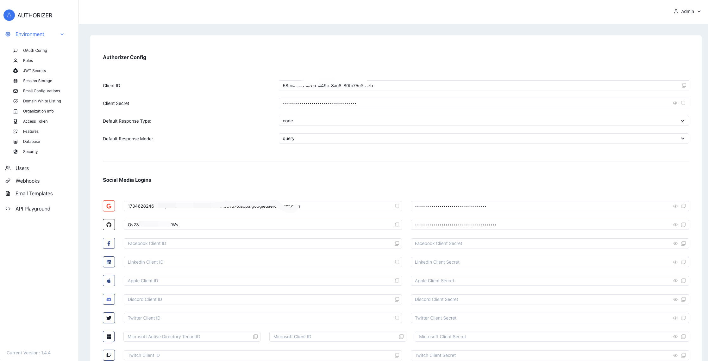
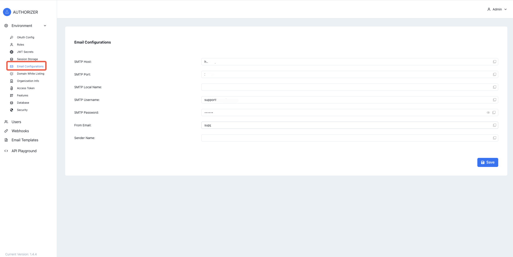
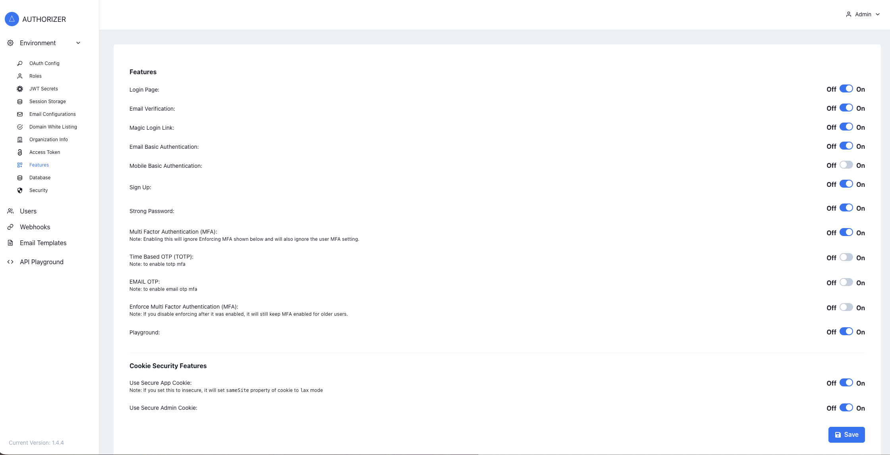

# Authorizer 授权服务

社区开源项目，负责用户注册、登录等功能。

## 项目地址
- 社区官网: https://authorizer.dev/
- 项目安装包地址: [https://github.com/authorizerdev/authorizer/releases](https://github.com/authorizerdev/authorizer/releases)
- 社区文档地址：https://docs.authorizer.dev/

## 部署

- 服务器要求
  - 至少2核2G内存(x86架构)
  - 10G硬盘
  - Ubuntu 22.04+
  - Golang >= v1.15

### 手动部署

- 访问官网：项目安装包地址
  

- 选择适合的系统的安装包以及版本（建议选择最新版本），例如：authorizer-1.4.4-linux-amd64.tar.gz
  

- 将下载的安装包，例如（authorizer-1.4.4-linux-amd64.tar.gz）上传到服务器

- 解压安装包，例如这里下载的authorizer-1.4.4-linux-amd64.tar.gz

  - 解压安装包
  ```bash
  bash <(tar -zxf AUTHORIZER_VERSION -c authorizer)
  ```
  - 进入解压目录
  ```bash
  bash <(cd authorizer)
  ```
  - 启动命令
  ```bash
  bash <(./build/server)
  ```

### 配置文件

#### .env文件

- 在解压后的目录中找到.env文件,如果没有，自行创建一个.env的文件，内容如下：
```.env
# .env文件内容示例
ENV=production
DATABASE_URL=data.db
DATABASE_TYPE=sqlite
CUSTOM_ACCESS_TOKEN_SCRIPT="function(user,tokenPayload){var data = tokenPayload;data.extra = {'x-extra-id': user.id};return data;}"
DISABLE_PLAYGROUND=false
ADMIN_SECRET=123456
PORT=80
```
- .env文件说明
  - ENV=production：环境配置，无需修改
  - DATABASE_URL=data.db：数据库地址，支持Postgres、MySQL等多种数据库，如对数据库无要求，无需修改
  - DATABASE_TYPE=sqlite：数据库类型
  - CUSTOM_ACCESS_TOKEN_SCRIPT：无需修改
  - DISABLE_PLAYGROUND=false：无需修改
  - ADMIN_SECRET=123456：部署之后管理员（admin）登录密码
  - PORT=80，服务部署端口号

!> **注意**: 项目部署要使用域名，访问管理端时，一定要用域名访问，否则获取不到ClientID

## 使用

- 项目启动之后，访问你的部署地址，例如：https://yourdomain ,出现登录页面
  
- 登录项目，使用.env中配置的密码
  
- 登录成功之后，选择左侧Environment目录的OAuth Config菜单，可获取Authorizer Config配置，Client ID以及Client Secret
- 如果需要社交媒体登录，则去相应的社交媒体获取Client ID和Secret填写到 OAuth Config菜单中的Social Media Logins，社交媒体各自获取过程不在详细介绍
- 邮箱配置，选择左侧菜单Environment中的Email Configurations配置邮箱的SMTP服务，填写SMTP Host、SMTP Port、SMTP Username、SMTP Password、From Email参数并保存
  
- 选择左侧菜单Environment中的Features进行登录配置，根据需要选择配置，注意可关闭Mobile Basic Authentication，目前不支持手机号验证身份
  
- 选择Magic Login Link开启，则启用邮箱链接登录，无需输入密码
- 选择合适的登录验证方式，点击下面的"Save",保存配置
- 将Client ID、Client Secret、authorizer部署地址设置到ucenter的配置文件中，则ucenter可使用authorizer登录
- 如需使用authorizer的其他功能，请查看官方文档
