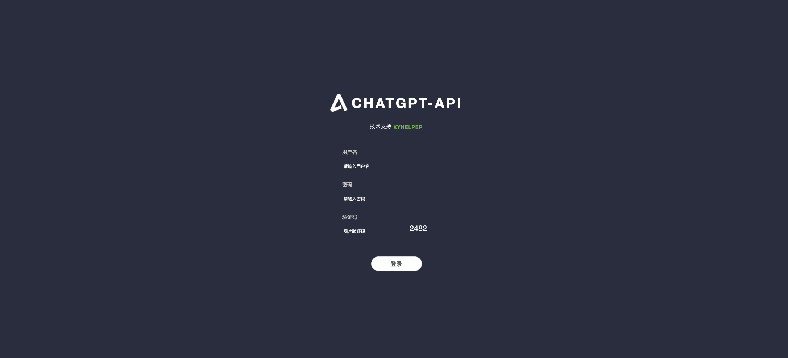

# ChatGPT-Api服务

- 本文档主要介绍 ChatGPT-Api 部署方式以及参数配置

## 部署

- 前置条件
  - 一台至少 2 核 2G 内存的服务器,推荐使用香港、新加坡、日本地区的服务器,可以兼顾国内访问。
  - 安装了 docker 和 docker-compose
  - 安装了 git
  - 有官网直登账号(不支持谷歌、微软、苹果等第三方登陆账号)

### 一键部署脚本
```bash
bash <(curl -sSfL https://raw.githubusercontent.com/xyhelper/chatgpt-api-server-deploy/master/quick-install.sh | bash)
```

### 手动部署
- 克隆仓库到服务器上
```bash
bash <(git clone --depth=1 https://github.com/xyhelper/chatgpt-api-server-deploy.git chatgpt-api)
```
- 进入目录
```bash
bash <(cd chatgpt-api)
```
- 启动服务
```bash
bash <(./deploy.sh)
```

### 配置文件

#### docker-compose.yml文件

在chatgpt-api目录下，有一个docker-compose.yml文件，找到这个文件并打开，找到chatgpt-api-server部分

```docker-compose.yml
# docker-compose.yml文件内容示例
...
    chatgpt-api-server:
        image: ghcr.io/xyhelper/chatgpt-api-server:latest
        container_name: chatgpt-api-server
        restart: always
        ports:
        - 8100:8001
        environment:
        TZ: Asia/Shanghai                   # 指定时区
        CHATPROXY: ""                       # 接入网关地址
        AUTHKEY: ""                         # 接入网关的authkey
        FILE_SERVER_PREFIX:""               # 文件下载地址
        FILEDOWNLOADPROXY:""                # 上传文件下载代理
        S3REGION:""                         # S3存储区域，如 us-east-1、ap-southeast-1 等
        S3ENDPOINT:""                       # S3服务端点地址，使用非AWS的S3兼容存储时需填写，如 https://s3.example.com
        S3ACCESSKEYID:""                    # S3访问密钥ID，用于身份认证
        S3KEYSECRET:""                      # S3访问密钥Secret，与ACCESSKEYID配合使用
        S3BUCKETNAME:""                     # S3存储桶名称，用于存放上传文件
        S3URL:""                            # S3文件访问的公开URL前缀，用于生成文件访问链接
        volumes:
        - ./data/chatgpt-api-server/:/app/data/
        labels:
        - "com.centurylinklabs.watchtower.scope=xyhelper-chatgpt-api-server"
...
```

#### docker-compose.yml配置说明

!> **注意**: docker-compose.yml文件除以下配置外，其余无需变动.

- 服务端口
  - 8100：服务部署的对外端口，保证服务器的8100端口没有被占用，也可自定义成其他端口
  - 8001：docker容器中服务的端口，无需改动
- CHATPROXY
  - chatgpt-api代理服务的地址 
  - 例如：
    - `CHATPROXY=https://chat.XXX.com`
- AUTHKEY
  - 接入网关的鉴权密钥，用于验证请求合法性
  - 例如：
    - `AUTHKEY=your_auth_key`
- FILE_SERVER_PREFIX
  - 文件服务的访问地址前缀。配置后，ChatGPT上传的文件将缓存到本地服务器，并通过该地址对外提供访问，避免直接暴露原始文件地址。
  - 例如：
    - `FILE_SERVER_PREFIX=https://files.XXX.com`

!> **文件存储优先级说明**<br>
① 配置了 S3 参数 → 文件上传至 S3，`FILE_SERVER_PREFIX` 不生效<br>
② 未配置 S3，配置了 `FILE_SERVER_PREFIX` → 文件缓存到本地服务器<br>
③ 两者均未配置 → 文件地址将直接指向接入网关，**存在接入点地址暴露的风险**

- FILEDOWNLOADPROXY
  - 文件下载代理地址。当用户在对话中引用自有文件服务器上的文件时，ChatGPT会主动下载该文件，此过程可能导致文件服务器地址被暴露。配置此项后，下载请求将通过该代理转发，从而隐藏真实的文件服务器地址。
  - 例如：
    - `FILEDOWNLOADPROXY=https://proxy.XXX.com`
- S3REGION
  - S3存储区域，AWS S3填写对应区域代码，Cloudflare R2填写 `auto`
  - 例如：
    - `S3REGION=auto`
- S3ENDPOINT
  - S3服务端点地址，使用非AWS的S3兼容存储时需填写，AWS S3留空即可
  - 例如：
    - `S3ENDPOINT=https://<ACCOUNT_ID>.r2.cloudflarestorage.com`
- S3ACCESSKEYID
  - S3访问密钥ID，用于身份认证
  - 例如：
    - `S3ACCESSKEYID=xxxxxxxxxxxxxxxxxxxxxxxxxxxxxxxx`
- S3KEYSECRET
  - S3访问密钥Secret，与S3ACCESSKEYID配合使用
  - 例如：
    - `S3KEYSECRET=xxxxxxxxxxxxxxxxxxxxxxxxxxxxxxxx`
- S3BUCKETNAME
  - S3存储桶名称
  - 例如：
    - `S3BUCKETNAME=my-bucket`
- S3URL
  - S3文件访问的公开URL前缀，用于生成文件的访问链接
  - 例如：
    - `S3URL=https://pub-xxxxxxxxxxxxxxxxxxxxxxxxxxxxxxxx.r2.dev`


## 使用

### 后台管理
- 登录
  - ChatGPT-api-server部署成功之后，访问：http://yourdomain/xyhelper, 访问后端管理地址，初始账号密码：admin/123456
   
- 工作台-账号管理
  - 管理ChatGPT-api的session账号
- 工作台-用户管理
  - 管理ChatGPT的用户

### 模拟API接口地址
- gpt会话接口
    - http://服务器IP:8100/v1/chat/completions
- 模型列表接口
    - http://服务器IP:8100/v1/chat/models
- codex会话接口
    - http://服务器IP:8100/v1/chat/responses


