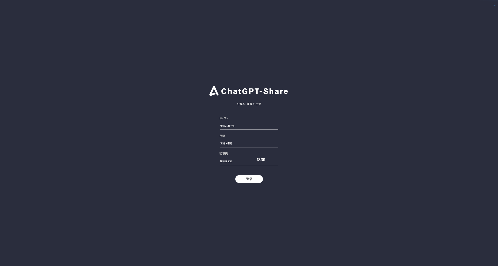
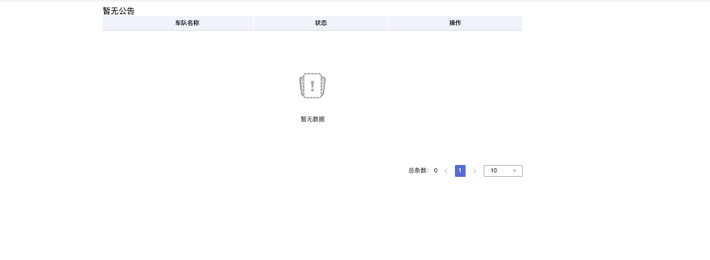

# ChatGPT-Share服务

- 本文档仅介绍 ChatGPT-Share 与授权服务的对接方法，完整文档请访问：https://chatgpt-share-server-aug.pages.dev/

## 部署

### 一键部署脚本
```bash
bash <(curl -sSfL https://raw.githubusercontent.com/xyhelper/chatgpt-share-server/deploy/quick-install.sh | bash)
```

### 手动部署
- 克隆仓库到服务器上
```bash
bash <(git clone --depth=1 https://github.com/xyhelper/chatgpt-share-server-deploy.git chatgpt-share-server)
```
- 进入目录
```bash
bash <(cd chatgpt-share-server)
```
- 启动服务
```bash
bash <(./deploy.sh)
```

### 配置文件

#### docker-compose.yml文件

在chatgpt-share-server目录下，有一个docker-compose.yml文件，找到这个文件并打开，找到chatgpt-share-server部分

```docker-compose.yml
# docker-compose.yml文件内容示例
...
    chatgpt-share-server:
    image: xyhelper/chatgpt-share-server:latest
    restart: always
    ports:
      - 8300:8001
    environment:
      TZ: Asia/Shanghai # 指定时区
      # 接入网关地址
      CHATPROXY: "https://demo.xyhelper.cn"
      # 接入网关的authkey
      AUTHKEY: "xyhelper"
      # 内容审核及速率限制
      AUDIT_LIMIT_URL: "http://auditlimit:8080/audit_limit"
      # 授权登录接口地址
      OAUTH_URL:""
...
```

## 授权服务对接

### 需提供授权服务接口

  - 授权接口
    - 接口地址：https://用户自定义/xxx（需配置在docker-compose.yml系统变量：OAUTH_URL），注意：此为授权服务接口地址
    - 请求方式：post
    - 请求参数：
      - usertoken：           用户token，必填，string（usertoken作为用户唯一属性在share服务中是会话隔离的重要依据，同一用户的usertoken请勿随意更改）
      - carid：               车辆id（车队名称），必填，string
      - 示例：
      ```请求数据结构
            {
                "usertoken": "", 
                "carid": ""
            }
      ```
    - 请求响应：
      - code：  状态码，1：登录成功，其他：登录失败
      - msg：   提示信息
      - 示例：
      ```响应数据结构
            {
                "code": 1, 
                "msg": "登录成功",
                "usertoken":"用户token，可选，作为share服务中区分用户的唯一属性，会话隔离的依据，如果不返回，则默认请求中的参数usertoken"
                "carid":"请求会话的车辆id，可选，如果不返回，默认请求中的参数carid"
                "expireTime":"yyyy-MM-dd HH:mm:ss"  //userToken过期时间，必填
            }
      ```

## 使用

### 后台管理
- 登录
  - ChatGPT-share-server部署成功之后，访问：http://yourdomain/xyhelper, 访问后端管理地址，初始账号密码：admin/123456
   
- 工作台-账号管理
  - 管理ChatGPT的session账号
- 工作台-用户管理
  - 管理ChatGPT的用户
- 工作台-会话管理
  - 管理ChatGPT的会话

### 选车页面
- ChatGPT-share-server部署成功之后，访问：http://yourdomain, 访问选车页面

  

### 接口地址访问
- 使用前提
  - 配置OAUTH_URL的接口地址
- 接口
  - 接口地址：http://yourdomain/auth/logintoken
  - 请求方式：get/post
  - 参数：
    - usertoken：用户token，必填
    - carid：车辆id（车队名称），必填
    - resptype：返回结果类型，（填写：json结果返回json，不填默认返回页面）
    - 示例：
        - get请求
        ```
          http://yourdomain/auth/logintoken?resptype=&usertoken=&carid=
        ```
        - post请求
        ```
          http://yourdomain/auth/logintoken

          body参数
          {
                "resptype":"",
                "usertoken":"",
                "carid":""
            }
        ```

  - 请求响应：
    - 当请求参数resptype为空或者不是json时，成功跳转会话页面，失败跳转登录页面提示错误
    - 当请求参数resptype=json，返回json数据，如下面示例
    - 示例：
      - resptype传递json时
        ```
          成功响应
          {
              "code": 1,
              "msg": "登录成功"
          }
          失败响应
          {
              "code": 0,
              "msg": "登录错误"
          }
        ```
