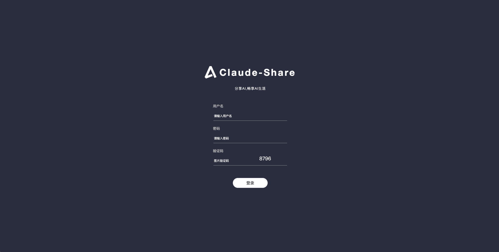
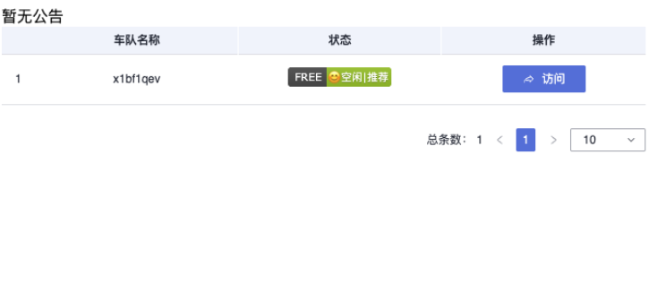

# Claude-Share服务

## 部署

- 前置条件
  - 客户可对接符合标准OAuth2.0协议的自定义用户服务，或选择对接ucenter用户中心服务
  - 若对接用户自定义OAuth2.0服务，可查看下面用户OAuth2.0对接步骤说明
  - 若对接ucenter服务，需要将ucenter部署完成并获取相关信息，ucenter部署及配置请查看ucenter部署文档
- 服务器要求
  - 至少2核2G内存(x86架构)
  - 10G硬盘
  - Ubuntu 22.04+
  - 已安装 Docker 和 Docker-Compose
  - 服务器已安装curl和git

### 一键部署脚本
```bash
bash <(curl -sSfL https://raw.githubusercontent.com/xyhelper/claude-share-server-deploy/master/quick-install.sh | bash)
```

### 手动部署
- 克隆仓库到服务器上
```bash
bash <(git clone --depth=1 https://github.com/xyhelper/claude-share-server-deploy.git claude-share-server)
```
- 进入目录
```bash
bash <(cd claude-share-server)
```
- 启动服务
```bash
bash <(./deploy.sh)
```

### 配置文件

#### docker-compose.yml文件

在claude-share-server目录下，有一个docker-compose.yml文件，找到这个文件并打开，找到backend部分

```docker-compose.yml
# docker-compose.yml文件内容示例
services:

  backend:
    image: ghcr.io/xyhelper/claude-share-server
    ports:
      - "8700:8001"                 #服务端口
    environment:
      - TZ=Asia/Shanghai
      - CLAUDEPROXY=                #claude代理地址
      - CALLBACKURL=                #本服务回调地址
      - XYUCENTER=                  #用户自定义OAuth2.0服务地址或ucenter（用户中心）部署地址
      - APPID=                      #子应用ID
      - APPSECRET=                  #子应用密钥
      - APPJWTSECRETKEY=            #子应用JWT token秘钥
    volumes:
      - ./backend/manifest:/app/manifest
      - ./config/config.yaml:/app/config.yaml   #config.yaml配置文件
      - ./keywords.txt:/app/data/keywords.txt   #敏感词文件
    restart: unless-stopped
...
```

#### docker-compose.yml配置说明

!> **注意**: docker-compose.yml文件除以下配置外，其余无需变动.

- 服务端口
  - 8700：服务部署的对外端口，保证服务器的8700端口没有被占用，也可自定义成其他端口
  - 8001：docker容器中服务的端口，无需改动
- CLAUDEPROXY
  - claude代理服务的地址 
  - 例如：
       - -CLAUDEPROXY=https://claude.XXX.com
- CALLBACKURL
  - 该项目部署完成之后的服务地址，主要用于回调，例如：https://yourdomain.com， 设置到CALLBACKURL
  - 例如：
       - -CALLBACKURL=https://yourdomain.com
- XYUCENTER
  - 用户自定义OAuth2.0服务地址或ucenter用户中心部署地址，例如：https://ucenter.com， 设置到XYUCENTER
  - 例如：
       - -XYUCENTER=https://ucenter.com
- APPID
  - 用户自定义OAuth2.0服务或ucenter用户中心配置的该子应用的应用代码，用户自定义OAuth2.0服务自行设置获取，ucenter方式请查看ucenter部署步骤
  - 用于校验是否在用户中心注册，如果用户自定义OAuth2.0服务无需校验，可以不配置，但若对接ucenter则必须配置
  - 例如：
       - -APPID=XXX
- APPSECRET
  - 用户自定义OAuth2.0服务或ucenter用户中心配置的该子应用的应用密钥，用户自定义OAuth2.0服务自行设置获取，ucenter方式请查看ucenter部署步骤
  - 用于校验是否在用户中心注册，如果用户自定义OAuth2.0服务无需校验，可以不配置，但若对接ucenter则必须配置
  - 例如：
       - -APPSECRET=XXX
- APPJWTSECRETKEY
  - jwt密钥
  - 如对接用户自定义OAuth2.0服务，则需要用户自定义OAuth2.0服务使用该密钥对access_token进行加密，以便claude-share服务解析关键参数
  - 如对接ucenter服务，则该密钥保持与ucenter配置文件中的JWT_SECRET_KEY保持一致
  - 例如ucenter中的：-JWT_SECRET_KEY=XXX，这里也配置一致
     - -JWT_SECRET_KEY=XXX
  
#### config.yaml配置文件              

在claude-share-server目录下，找到config文件夹，文件夹下有config.yml文件，打开找到openai内容审核和模型速率限制部分

```config.yml
# config.yml文件内容示例
...
# openai 内容审核
OAIKEY: "" # OpenAI API key 用于内容审核
MODERATION: ""
# 模型速率限制
DEFAULT: ""
Opus4.1: ""
Opus3: ""
Sonnet4: ""
Sonnet3.7: ""
Haiku3.5: ""
...
```

#### config.yaml配置说明  

!> **注意**: config.yaml文件除以下配置外，其余无需变动.

- openai 内容审核
  - OAIKEY：OpenAI API key 用于内容审核，没有可以不配置
  - MODERATION: OpenAI内容审核地址，没有可以不配置

- 模型速率限制
  - claude各个模型速率限制
  - 内容设置: "20/1h"，代表：1小时内最多请求20次

- 完整的配置，例如：

```config.yml
# config.yml文件内容示例
...
# openai 内容审核
OAIKEY: "******" # OpenAI API key 用于内容审核
MODERATION: "https://api.openai.com/v1/moderations"
# 模型速率限制
DEFAULT: "20/3h"
Opus4.1: "20/3h"
Opus3: "20/3h"
Sonnet4: "20/3h"
Sonnet3.7: "20/3h"
Haiku3.5: "20/3h"
...
```

#### keywords.txt配置说明

- 敏感词配置文件，在该文件中设置敏感词，用换行符隔开
  - 例如：
```keywords.txt
WC
TMD
...
```

### 启动/更新服务
```bash
cd claude-share-server
./deploy.sh
```
### 查看日志
```bash
cd claude-share-server
docker-compose logs -f --tail=100
```
### 停止服务
```bash
cd claude-share-server
docker-compose down
```
### 重启服务
```bash
cd claude-share-server
docker-compose restart
```

## 用户自定义OAuth2.0服务对接

### 自定义服务提供接口
- 需用户自定义服务提供Oauth2.0标准接口
  - 授权接口
    - 接口地址：https://yourdomain/authorize
    - 请求方式：get
    - 请求参数：
      - response_type：           授权类型参数，必填，string，支持code（授权码）
      - client_id：               应用id，必填，string
      - redirect_uri：            回调地址，必填，string，claude-share应用回调地址
      - scope：                   授权范围，必填，string，支持openid email profile
      - prompt：                  登录提示，选填，string
    - 请求响应：claude-share登录时调用该接口，用户自定义OAuth2.0服务自行实现登录和授权流程。授权成功后，用户自定义OAuth2.0根据 redirect_uri 参数回调到claude-share访问地址，并携带授权码等相关参数
  - 令牌端点接口
    - 接口地址：https://yourdomain/oauth/token
    - 请求方式：post
    - 请求参数：
      - grant_type：         授权类型，必填，string，可选值：authorization_code或者refresh_token，用于通过code换取token或者通过refresh_token刷新access_token
      - code：               授权码，非必填，string，用户自定义OAuth2.0授权后，claude-share从回调地址redirect_uri中获取，grant_type值为authorization_code时必填
      - client_id：          应用id，非必填，string，如果您的Oauth2.0服务没有校验客户端id和密钥，可不填
      - client_secret：      应用密钥，非必填，string，如果您的Oauth2.0服务没有校验客户端id和密钥，可不填
      - refresh_token：      刷新令牌，非必填，string，用于刷新access_token，grant_type值为refresh_token时必填
    - 请求响应：
      - access_token：              访问令牌，用户自定义的OAuth2.0服务需根据上文中配置的jwt密钥加密access_token，再给claude-share返回
      - refresh_token：             刷新令牌
      - expires_in：                访问令牌过期时间
      - refresh_expires_in：        刷新令牌过期时间
      - token_type：                令牌类型

### access_token数据及加密
- access_token数据结构
  - 保证access_token加密前和解密后数据为下面列出的json格式
  - products数组为账号可访问的claude服务，以claude-开头，二级以free、pro、max拼接，也可定义三级，三级可按照自己使用场景自行定义，例如可自定义成claude-free-test，也可不定义三级
    - claude-free：claude免费号服务
    - claude-pro：claude的pro账号服务
    - claude-max：claude的max账号服务
  - 访问服务权限等级：max>pro>free，即拥有pro服务的账号也可访问free车辆，拥有max服务的账号也可访问pro和free的车辆
```access_token数据结构
{
    "username": "用户名，string类型，必填，可与email保持一致", 
    "nickname": "昵称，string类型，必填", 
    "email": "邮箱，string类型，必填", 
    "auth0_sub": "OAuth唯一属性，string类型，必填", 
    "products": [
        {
            "code": "可访问服务code，以'claude-'开头", 
            "name": "可访问服务名称"
        }
    ]
}
```

- access_token加密
  - access_token解密密钥为环境变量配置中的APPJWTSECRETKEY，用户自定义OAuth2.0服务中加密要保证密钥相同
  - 使用 JWT 标准的 HS256（HMAC-SHA256）对称加密签名方式进行令牌签名，令牌（密钥）与claude-share环境变量配置保持一致


## 使用

### 后台管理
- 登录
  - claude-share-server部署成功之后，访问：http://yourdomain/xyhelper, 访问后端管理地址，初始账号密码：admin/123456
   
- 工作台-账号管理
  - 管理claude的session账号
- 工作台-会话管理
  - 管理claude的会话

### 选车页面
- claude-share-server部署成功之后，访问：http://yourdomain, 访问选车页面
  
- 选择账号订购的claude服务车队或者免费车队，点击访问，进行OAuth2.0登录，登录之后即可使用claude-share服务

