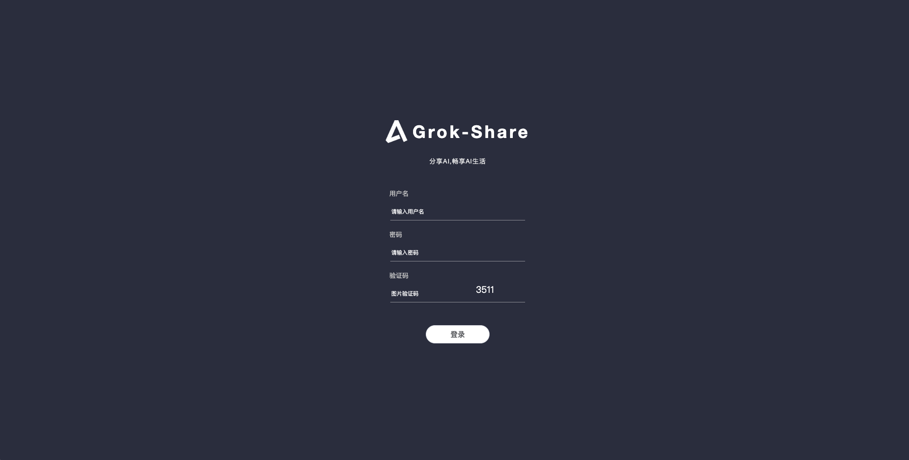

# Grok-Share服务

## 部署

- 前置条件
  - ucenter服务已经部署完成，获取到服务地址
  - ucenter服务中已配置grok-share子应用的应用代码和应用密钥
  - ucenter服务中已配置grok-share的商品服务（免费或付费）
  - ucenter服务部署以及子应用及服务配置，请查看ucenter部署步骤

- 服务器要求
  - 至少2核2G内存(x86架构)
  - 10G硬盘
  - Ubuntu 22.04+
  - 已安装 Docker 和 Docker-Compose
  - 服务器已安装curl和git

### 一键部署脚本
```bash
bash <(curl -sSfL https://raw.githubusercontent.com/xyhelper/grok-share-server-deploy/master/quick-install.sh | bash)
```

### 手动部署  
- 克隆仓库到服务器上
```bash
bash <(git clone --depth=1 https://github.com/xyhelper/grok-share-server-deploy.git grok-share-server)
```
- 进入目录
```bash
bash <(cd grok-share-server)
```
- 启动服务
```bash
bash <(./deploy.sh)
```

### 配置文件

#### docker-compose.yml文件

在grok-share-server目录下，有一个docker-compose.yml文件，找到这个文件并打开，找到backend部分

```docker-compose.yml
# docker-compose.yml文件内容示例
services:

  backend:
    image: ghcr.io/xyhelper/grok-share-server
    ports:
      - "8800:8001"
    environment:
      - TZ=Asia/Shanghai
      - GROKPROXY=                                #grok代理地址
      - CALLBACKURL=                              #本服务回调地址
      - XYUCENTER=                                #xyucenter（用户中心）部署地址
      - APPID=                                    #子应用ID
      - APPSECRET=                                #子应用密钥
      - APPJWTSECRETKEY=                          #子应用JWT token秘钥
    volumes:
      - ./backend/manifest:/app/manifest
      - ./config/config.yaml:/app/config.yaml     #config.yaml配置文件
      - ./keywords.txt:/app/data/keywords.txt     #敏感词文件
    restart: unless-stopped
...
```

#### docker-compose.yml配置说明

!> **注意**: docker-compose.yml文件除以下配置外，其余无需变动.

- 服务端口
  - 8800：服务部署的对外端口，保证服务器的8800端口没有被占用，也可自定义成其他端口
  - 8001：docker容器中服务的端口，无需改动
- GROKPROXY
  - grok代理服务的地址 
  - 例如：
       - -GROKPROXY=https://grok.XXX.com
- CALLBACKURL
  - 该项目部署完成之后的服务地址，主要用于回调，例如：https://yourdomain.com， 设置到CALLBACKURL
  - 例如：
       - -CALLBACKURL=https://yourdomain.com
- XYUCENTER
  - ucenter用户中心部署地址，例如：https://ucenter.com， 设置到XYUCENTER
  - 例如：
       - -XYUCENTER=https://ucenter.com
- APPID
  - ucenter用户中心配置的该子应用的AppId，用于从ucenter服务使用code换取token的身份验证，具体获取方式可查看ucenter部署步骤
  - 例如：
       - -APPID=XXX
- APPSECRET
  - ucenter用户中心配置的该子应用的应用密钥，用于从ucenter服务使用code换取token的身份验证，具体获取方式可查看ucenter部署步骤
  - 例如：
       - -APPSECRET=XXX
- APPJWTSECRETKEY
  - jwt密钥，该密钥应该与ucenter配置文件中的JWT_SECRET_KEY保持一致，否则子应用无法解析
  - 例如ucenter中的：-JWT_SECRET_KEY=XXX，这里也配置一致
     - -JWT_SECRET_KEY=XXX
  
#### config.yaml配置文件              

在grok-share-server目录下，找到config文件夹，文件夹下有config.yml文件，打开找到openai内容审核和模型速率限制部分

```config.yml
# config.yml文件内容示例
...
# openai 内容审核
OAIKEY: "" # OpenAI API key 用于内容审核
MODERATION: ""
# 模型速率限制
DEFAULT: ""
grok-4-mini-thinking-tahoe: ""
grok-4: ""
grok-4-heavy: ""
grok-3: ""
...
```

#### config.yaml配置说明  

!> **注意**: config.yaml文件除以下配置外，其余无需变动.

- openai 内容审核
  - OAIKEY：OpenAI API key 用于内容审核，没有可以不配置
  - MODERATION: OpenAI内容审核地址，没有可以不配置

- 模型速率限制
  - grok各个模型速率限制
  - 内容设置: "20/1h"，代表：1小时内最多请求20次

- 完整的配置，例如：

```config.yml
# config.yml文件内容示例
...
# openai 内容审核
OAIKEY: "******" # OpenAI API key 用于内容审核
MODERATION: "https://api.openai.com/v1/moderations"
# 模型速率限制
DEFAULT: "20/3h"
grok-4-mini-thinking-tahoe: "20/3h"
grok-4: "20/3h"
grok-4-heavy: "20/3h"
grok-3: "20/3h"
...
```

#### keywords.txt配置说明

- 敏感词配置文件，在该文件中设置敏感词，用换行符隔开
  - 例如：
```keywords.txt
WC
TMD
...
```

### 启动/更新服务
```bash
cd grok-share-server
./deploy.sh
```
### 查看日志
```bash
cd grok-share-server
docker-compose logs -f --tail=100
```
### 停止服务
```bash
cd grok-share-server
docker-compose down
```
### 重启服务
```bash
cd grok-share-server
docker-compose restart
```

## 使用

### 后台管理
- 登录
  - grok-share-server部署成功之后，访问：http://yourdomain/xyhelper, 访问后端管理地址，初始账号密码：admin/123456
   
- 工作台-账号管理
  - 管理grok的sso账号
- 工作台-会话管理
  - 管理grok的会话

### 选车页面
- grok-share-server部署成功之后，访问：http://yourdomain, 访问选车页面
  
- 选择账号订购的grok服务车队或者免费车队，点击访问，进行OAuth登录，登录之后即可使用grok服务

