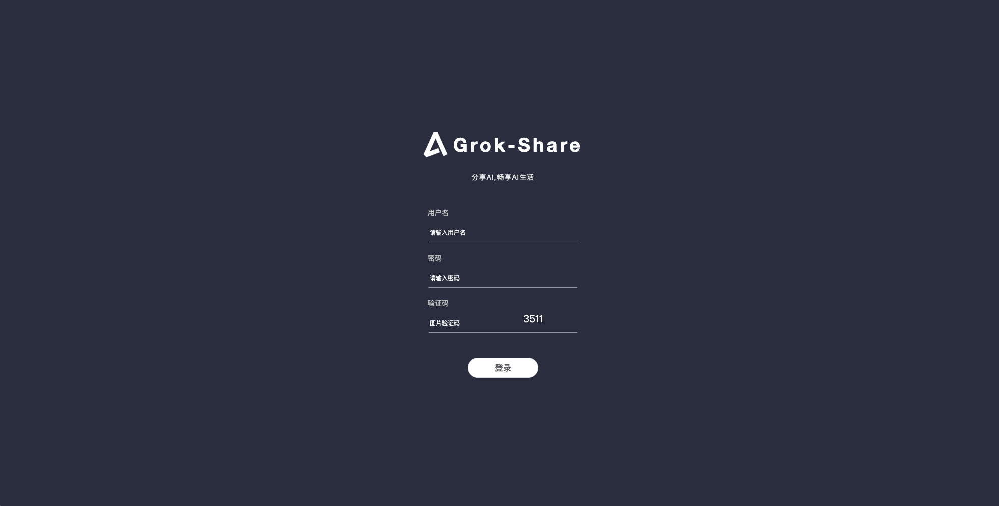

# Grok-Share服务

## 部署

- 前置条件
  - 部署grok-share服务时，授权服务对接有以下四种方式可选
    - 对接ucenter用户中心服务，详细部署及配置请参考ucenter部署文档
    - 对接ucenter-lite用户中心演示版，详细部署及配置请参考ucenter-lite部署文档
    - 对接自定义OAuth2.0服务，具体对接操作请参见本文档“自定义OAuth2.0服务对接”章节
    - 对接自定义授权服务，具体对接操作请参见本文档“自定义授权服务对接”章节
  - 以上授权方式四选一，按需选择一种即可

  > **注意**: 若后续配置AUTHORIZERURL，自定义授权服务会生效，XYUCENTER会自动失效

- 服务器要求
  - 至少2核2G内存(x86架构)
  - 10G硬盘
  - Ubuntu 22.04+
  - 已安装 Docker 和 Docker-Compose
  - 服务器已安装curl和git

### 一键部署脚本
```bash
bash <(curl -sSfL https://raw.githubusercontent.com/xyhelper/grok-share-server-deploy/master/quick-install.sh | bash)
```

### 手动部署  
- 克隆仓库到服务器上
```bash
bash <(git clone --depth=1 https://github.com/xyhelper/grok-share-server-deploy.git grok-share-server)
```
- 进入目录
```bash
bash <(cd grok-share-server)
```
- 启动服务
```bash
bash <(./deploy.sh)
```

### 配置文件

#### docker-compose.yml文件

!> **注意**: 请先确认授权方式与环境变量关系，再进行 `docker-compose.yml` 配置。

- `XYUCENTER` 与 `AUTHORIZERURL` 二选一，填写 `AUTHORIZERURL` 后 `XYUCENTER` 自动失效，请勿同时配置。
- `docker-compose.yml` 中部分环境变量为条件必填，请按所选授权方式配置。

在grok-share-server目录下，有一个docker-compose.yml文件，找到这个文件并打开，找到backend部分

```docker-compose.yml
# docker-compose.yml文件内容示例
services:

  backend:
    image: ghcr.io/xyhelper/grok-share-server
    ports:
      - "8800:8001"
    environment:
      - TZ=Asia/Shanghai
      - GROKPROXY=                                #grok代理地址  （必填）
      - CALLBACKURL=                              #本服务回调地址 （条件必填：对接ucenter、ucenter-lite、自定义OAuth2.0时必填）
      - XYUCENTER=                                #ucenter服务地址/ucenter-lite服务地址/自定义OAuth2.0服务地址 （条件必填：对接相应服务时必填）
      - AUTHORIZERURL=                            #自定义授权服务接口地址 （条件必填：对接自定义授权服务时必填；设置后默认启用自定义授权服务，XYUCENTER失效）
      - APPID=                                    #子应用ID  （条件必填：对接ucenter时必填，其他可不填）
      - APPSECRET=                                #子应用密钥 （条件必填：对接ucenter时必填，其他可不填）
      - APPJWTSECRETKEY=                          #子应用JWT token密钥  （条件必填：对接ucenter、ucenter-lite、自定义OAuth2.0时必填，且需与授权服务JWT密钥一致）
      - AUDIT_LIMIT_URL=                          #自定义审核限流接口地址 （选填，填写之后，请自行实现审核限流服务，系统不再使用内置审核限流模式，config.yaml中内容审核、模型速率限制配置以及外挂敏感词文件keywords.txt失效）
      - APIAUTH=                                  #adminapi接口鉴权秘钥  (选填，如果需要使用adminapi接口，请填写，并在调用接口时在 header 中传递 apiauth 字段，值为 APIAUTH配置的值)
    volumes:
      - ./backend/manifest:/app/manifest
      - ./config/config.yaml:/app/config.yaml     #config.yaml配置文件
      - ./keywords.txt:/app/data/keywords.txt     #敏感词文件
    restart: unless-stopped
...
```

#### docker-compose.yml配置说明

!> **注意**: docker-compose.yml文件除以下配置外，其余无需变动.

- 服务端口
  - 8800：服务部署的对外端口，保证服务器的8800端口没有被占用，也可自定义成其他端口
  - 8001：docker容器中服务的端口，无需改动
- GROKPROXY
  - grok代理服务的地址 
  - 例如：
    - `GROKPROXY=https://grok.XXX.com`
- CALLBACKURL
  - 该项目部署完成之后的服务地址，主要用于回调，例如：https://yourdomain.com， 设置到CALLBACKURL
  - 例如：
    - `CALLBACKURL=https://yourdomain.com`
- XYUCENTER
  - 自定义OAuth2.0服务地址或ucenter用户中心部署地址或ucenter-lite用户中心演示版部署地址，例如：https://ucenter.com， 设置到XYUCENTER
  - 例如：
    - `XYUCENTER=https://ucenter.com`
- AUTHORIZERURL
  - 自定义授权服务接口地址（服务接口地址），该项与 XYUCENTER 二选一，填写该项后 XYUCENTER 配置自动失效
  - 例如：
    - `AUTHORIZERURL=https://yourdomain/login`
- APPID
  - 用户自定义OAuth2.0服务或ucenter用户中心配置的该子应用的应用代码，用户自定义OAuth2.0服务自行设置获取，ucenter方式请查看ucenter部署步骤
  - 用于校验是否在用户中心注册，如果用户自定义OAuth2.0服务无需校验，可以不配置，但若对接ucenter则必须配置
  - 例如：
    - `APPID=XXX`
- APPSECRET
  - 用户自定义OAuth2.0服务或ucenter用户中心配置的该子应用的应用密钥，用户自定义OAuth2.0服务自行设置获取，ucenter方式请查看ucenter部署步骤
  - 用于校验是否在用户中心注册，如果用户自定义OAuth2.0服务无需校验，可以不配置，但若对接ucenter则必须配置
  - 例如：
    - `APPSECRET=XXX`
- APPJWTSECRETKEY
  - JWT密钥
  - 如对接用户自定义OAuth2.0服务，则需要用户自定义OAuth2.0服务使用该密钥对access_token进行加密，以便grok-share服务解析关键参数
  - 如对接ucenter服务，则该密钥保持与ucenter配置文件中的JWT_SECRET_KEY保持一致
  - 如对接ucenter-lite服务，则该密钥保持与ucenter-lite配置文件中的JWT_SECRET_KEY保持一致
  - 例如：若ucenter中配置为 `JWT_SECRET_KEY=XXX`，则此处也应配置为 `APPJWTSECRETKEY=XXX`
- AUDIT_LIMIT_URL
  - 用户自定义审核限流接口地址
  - 配置之后，系统内置审核限流配置失效，config.yaml中内容审核、模型速率限制配置以及外挂敏感词文件keywords.txt失效
  - 对接方式请查看本文档：自定义审核限流对接
  - 例如：
    - `AUDIT_LIMIT_URL=https://yourdomain/audit_limit`
- APIAUTH
  - adminapi接口鉴权秘钥
  - 当配置了环境变量 APIAUTH 或在 config.yaml 中配置了 APIAUTH 时，将启用 API 对接功能
  - 后台管理页面使用到的/admin/grok/xxx接口，将会有一份同样功能的副本 /adminapi/grok/xxx，这些接口将会使用 API 对接的方式进行访问
  - 具体使用即在 header 中传递 apiauth 字段，值为 APIAUTH，即可访问
  
#### config.yaml配置文件              

在grok-share-server目录下，找到config文件夹，文件夹下有config.yaml文件，打开找到openai内容审核和模型速率限制部分

!> **注意**: 若已在docker-compose.yml中配置了 `AUDIT_LIMIT_URL`（自定义审核限流接口），则本节中的 openai 内容审核与模型速率限制配置将**全部失效**，请参考[自定义审核限流接口对接](#自定义审核限流接口对接)章节。

- openai 内容审核
  - `OAIKEY`：OpenAI API key，用于内容审核，如无可留空
  - `MODERATION`：OpenAI内容审核地址，如无可留空

- 模型速率限制
  - 对grok各模型分别设置请求频率上限
  - 格式：`次数/时间窗口`，时间单位支持 `s`（秒）、`m`（分钟）、`h`（小时）、
  - 例如：`"20/3h"` 表示3小时内最多请求20次
  - 模型名称须与grok实际请求中的模型标识一致（配置文件中统一使用全大写）

- 完整配置示例：

```yaml
# config.yaml文件内容示例
...
# openai 内容审核
OAIKEY: "******" # OpenAI API key 用于内容审核
MODERATION: "https://api.openai.com/v1/moderations"
# 模型速率限制
DEFAULT: "20/3h"
AUTO: "20/3h"
FAST: "20/3h"
EXPERT: "20/3h"
TEST: "1/1h"
...
```

#### keywords.txt配置说明

- 敏感词配置文件，在该文件中设置敏感词，用换行符隔开
  - 例如：
```keywords.txt
WC
TMD
...
```

### 启动/更新服务
```bash
cd grok-share-server
./deploy.sh
```
### 查看日志
```bash
cd grok-share-server
docker-compose logs -f --tail=100
```
### 停止服务
```bash
cd grok-share-server
docker-compose down
```
### 重启服务
```bash
cd grok-share-server
docker-compose restart
```

## 自定义OAuth2.0服务对接

### 自定义OAuth2.0服务提供接口
- 需提供OAuth2.0标准接口
  - 授权接口
    - 接口地址：https://yourdomain/authorize
    - 请求方式：get
    - 请求参数：
      - response_type：           授权类型参数，必填，string，支持code（授权码）
      - client_id：               应用id，必填，string
      - redirect_uri：            回调地址，必填，string，grok-share应用回调地址
      - scope：                   授权范围，必填，string，支持openid email profile
      - prompt：                  登录提示，选填，string
    - 请求响应：grok-share登录时调用该接口，用户自定义OAuth2.0服务自行实现登录和授权流程。授权成功后，用户自定义OAuth2.0根据 redirect_uri 参数回调到grok-share访问地址，并携带授权码等相关参数
  - 令牌端点接口
    - 接口地址：https://yourdomain/oauth/token
    - 请求方式：post
    - 请求参数：
      - grant_type：         授权类型，必填，string，可选值：authorization_code或者refresh_token，用于通过code换取token或者通过refresh_token刷新access_token

      > **注意**: `authorization_code` 和 `refresh_token` 两种逻辑都必须实现。grok-share在换车时会使用 `refresh_token` 刷新 `access_token` 进行重新登录，缺少其中一种将导致换车功能失效。
      - code：               授权码，非必填，string，用户自定义OAuth2.0授权后，grok-share从回调地址redirect_uri中获取，grant_type值为authorization_code时必填
      - client_id：          应用id，非必填，string，如果您的Oauth2.0服务没有校验客户端id和密钥，可不填
      - client_secret：      应用密钥，非必填，string，如果您的Oauth2.0服务没有校验客户端id和密钥，可不填
      - refresh_token：      刷新令牌，非必填，string，用于刷新access_token，grant_type值为refresh_token时必填
    - 请求响应：
      - access_token：              访问令牌，用户自定义的OAuth2.0服务需使用 `APPJWTSECRETKEY`（JWT密钥）对access_token进行HS256签名，再给grok-share返回
      - refresh_token：             刷新令牌
      - expires_in：                访问令牌过期时间
      - refresh_expires_in：        刷新令牌过期时间
      - token_type：                令牌类型

### access_token数据结构和签名规则
- access_token数据结构
  - 保证access_token签名前和验签解析后数据为下面列出的json格式
  - products数组为账号可访问的grok服务，以grok-开头，二级以free、superGrok、heavy拼接，也可定义三级，三级可按照自己使用场景自行定义，例如可自定义成grok-free-test，也可不定义三级
    - grok-free：grok免费号服务
    - grok-superGrok：grok的superGrok账号服务
    - grok-heavy：grok的heavy账号服务
  - 访问服务权限等级：heavy>superGrok>free，即拥有superGrok服务的账号也可访问free车辆，拥有heavy服务的账号也可访问superGrok和free的车辆

```json
{
    "username": "用户名，string类型，必填，可与email保持一致", 
    "nickname": "昵称，string类型，必填", 
    "email": "邮箱，string类型，必填", 
    "auth0_sub": "OAuth唯一属性，string类型，必填", 
    "products": [
        {
            "code": "可访问服务code，以'grok-'开头", 
            "name": "可访问服务名称"
        }
    ]
}
```

- access_token签名
  - 使用 JWT 标准的 HS256（HMAC-SHA256）对称签名算法对access_token进行签名
  - 签名密钥为 `APPJWTSECRETKEY`（grok-share环境变量），用户自定义OAuth2.0服务中签名时必须使用相同的密钥

  > **关键**: 签名密钥必须与 `APPJWTSECRETKEY` 配置完全一致，否则grok-share验签将失败，且不会有明确的错误提示，导致所有登录请求失败。

## 自定义授权服务对接

### 需提供授权服务接口

!> **注意**: 一旦配置 AUTHORIZERURL，系统将自动启用自定义授权服务，ucenter、ucenter-lite、自定义 OAuth2.0 等其他授权方式将同时失效

  - 授权接口
    - 接口地址：https://yourdomain/login（需配置在docker-compose.yml系统变量：AUTHORIZERURL）
    - 请求方式：post
    - 请求参数：
      - userToken：           用户token，必填，string（用户唯一属性）
      - carid：               车辆id（车队名称），必填，string

      > **注意**: `userToken` 作为用户唯一属性，是会话隔离的重要依据，同一用户的 `userToken` 请勿随意更改。

      - 示例：
      ```json
            {
                "userToken": "", 
                "carid": ""
            }
      ```
    - 请求响应：
      - code：  状态码，0：登录成功，1：无权限，-1：登录失败
      - msg：   提示信息
      - expireTime：userToken过期时间，格式为 `yyyy-MM-dd HH:mm:ss`，不返回时默认1周
      - 示例：
      ```json
            {
                "code": 0, 
                "msg": "登录成功",
                "expireTime": "yyyy-MM-dd HH:mm:ss"
            }
      ```

## 自定义审核限流接口对接

!> **注意**: 一旦配置AUDIT_LIMIT_URL，系统内置审核限流配置将立即失效（config.yaml中内容审核、模型速率限制配置以及外挂敏感词文件keywords.txt均失效），需自行实现审核限流接口替代内置功能

### 提供自定义审核限流接口

> 通过自定义审核限流接口，您可以完全接管内容审核和速率控制逻辑，实现违禁词过滤、模型调用频率限制等自定义业务规则。

  - 审核限流接口
    - 接口地址：https://yourdomain/audit_limit（需配置在docker-compose.yml系统变量：AUDIT_LIMIT_URL），注意：此为审核限流接口地址
    - 请求方式：post
    - header参数：
      - Authorization:           Bearer <accessToken>（从该头中提取token，去掉Bearer前缀后进行验签解析，以获取用户信息）
      - Content-Type:            "application/json"（请求体类型）
      - Cookie:                  会话请求Cookie（通常由浏览器或HTTP客户端自动携带）
      - Referer:                 请求来源Referer（通常由浏览器自动携带）
      - User-Agent:              客户端标识User-Agent（通常由浏览器或HTTP客户端自动携带）
      - Carid:                   车辆id（车队名称，自定义header，请按实际车队透传）

      > **说明**: 除 `Authorization` 和 `Carid` 外，其余header通常由浏览器或HTTP客户端自动携带，服务端按需读取即可。
      
    - body参数：
      - grok会话请求body，请自行解析出会话模型以及会话内容，以便实现审核限流逻辑

        > **提示**: 当前已知可参考字段：`modeId`（会话模型）、`message`（会话内容），grok官方可能随时调整字段名，请以实际请求报文为准

    - 请求响应：
      - 审核通过：响应http状态码为200
      - 触发模型速率限制：响应http状态码为429，提示信息格式请参照grok官方接口返回
      - 触发内容审核限制：响应格式需与grok官方内容审核触发时的返回保持一致，请自行查阅grok官方文档确认（grok官方可能随时调整）
  - 接口代码示例（golang版本）

    > **注意**: 以下为逻辑结构示例，非完整可运行代码，`bannedWords` 和 `modelRate` 需替换为您实际的业务判断逻辑

    ```go
      func GrokAuditLimit(ctx context.Context) {
        r := ghttp.RequestFromCtx(ctx)
        accessToken := r.Header.Get("Authorization")
        // TODO 自行解析accessToken获取用户信息，用以判断审核限流逻辑

        carid := r.Header.Get("Carid")
        reqJson, err := r.GetJson()
        if err != nil {
          g.Log().Error(ctx, "GetJson", err)
          r.Response.Status = 400
          r.Response.WriteJson(g.Map{
            "error": err.Error(),
          })
          return
        }
        model := reqJson.Get("modeId").String()
        prompt := reqJson.Get("message").String()
        // TODO 根据accessToken解析的用户信息、carid、model、prompt等参数自行实现审核限流判断

        bannedWords = true //触发违禁词,请实现判断逻辑
        modelRate = true   //触发模型速率，请实现判断逻辑

        if bannedWords {
          // 判断提问内容是否包含禁止词
          r.Response.Status = 400
          r.Response.WriteJson(g.Map{
            "detail": "请珍惜账号,不要提问违禁内容.",
          })
          return
        } 
        if modelRate { // modelRate 为 true 时触发限流（请替换为您的实际判断逻辑）
          // 限流请求
          r.Response.Status = 429
          r.Response.WriteJson(g.Map{
            "detail": "You have triggered the usage frequency limit, please try again later.",
          })
          return
        }
        r.Response.Status = 200
        return
      }
    ```

  - accessToken解析
    - 用户若对接ucenter、ucenter-lite、OAuth2.0自定义服务，需按照JWT标准的HS256（HMAC-SHA256）算法验签解析accessToken
      > **关键**: 验签中使用的密钥必须与授权服务中的子应用签发的密钥保持一致（请参考ucenter或ucenter-lite部署文档中JWT_SECRET_KEY的配置）。否则验签失败，且不会有清楚的错误提示。
    - accessToken解析示例（golang版本，基于GoFrame框架）
      ```go
        // JWT Claims
        type Claims struct {
          // 用户基本信息
          UserId   uint   `json:"userId"` //这个用户id是用户中心的id，不是本系统的id
          Username string `json:"username"`
          Nickname string `json:"nickname"`
          Email    string `json:"email"`
          Phone    string `json:"phone"`
          Avatar   string `json:"avatar"`
          Auth0Sub string `json:"auth0_sub"`
          // 余额信息
          Balance string `json:"balance"`
          // 商品（服务）信息
          Products []g.Map `json:"products"`
          jwt.RegisteredClaims
        }

        func VerifyToken(ctx g.Ctx, accessToken string) (*Claims, error) {
          // 1. 去掉Bearer前缀（如果有）
          if strings.HasPrefix(accessToken, "Bearer ") {
            accessToken = strings.TrimPrefix(accessToken, "Bearer ")
          }
          // 2. 验签并解析Token
          token, err := jwt.ParseWithClaims(accessToken, &Claims{}, func(token *jwt.Token) (interface{}, error) {
            // 验证签名算法
            if _, ok := token.Method.(*jwt.SigningMethodHMAC); !ok {
              return nil, fmt.Errorf("unexpected signing method: %v", token.Header["alg"])
            }
            return []byte(config.APPJWTSECRETKEY), nil
          })
          if err != nil {
            return nil, err
          }
          if claims, ok := token.Claims.(*Claims); ok && token.Valid {
            return claims, nil
          }
          // 非GoFrame项目可直接返回errors.New("invalid token")
          return nil, fmt.Errorf("invalid access_token: token verification failed")
        }
      ```
    - 用户若对接自定义授权服务，请自行根据授权服务加密方式解密。若您的userToken无加密，则不必实现解密，可直接将userToken作为用户唯一标识，参与限流校验与会话隔离


## 使用

### 后台管理
- 登录
  - grok-share-server部署成功之后，访问：http://yourdomain/xyhelper, 访问后端管理地址，初始账号密码：admin/123456
   
- 工作台-账号管理
  - 管理grok的sso账号
- 工作台-会话管理
  - 管理grok的会话

### 选车页面
- grok-share-server部署成功之后，访问：http://yourdomain, 访问选车页面
  
- 选择账号订购的grok服务车队或者免费车队，点击访问，进行OAuth2.0登录，登录之后即可使用grok-share服务

### 接口地址访问
- 使用前提
  - 授权服务必须选择：自定义授权服务，且 `AUTHORIZERURL` 已正确配置并生效
  - 对接ucenter、ucenter-lite、自定义OAuth2.0均无法使用该接口
- 接口
  - 接口地址：http://yourdomain/auth/loginToken?userToken=xxx&carid=xxx
  - 请求方式：GET
  - URL参数：
    - userToken：用户token，必填（用户唯一属性）
    - carid：车辆id（车队名称），选填（若传递则按照该车辆进行会话，不传递则随机选择车辆进行会话）

  > **注意**: `userToken` 是会话隔离的重要依据，同一用户的 `userToken` 请勿随意更改。

  - 请求响应：
    - 该接口面向浏览器访问，以下响应行为以浏览器场景为准
    - 登录成功：直接跳转会话页面
    - 登录失败：页面将自动跳转至 error.html，并展示具体的错误提示信息