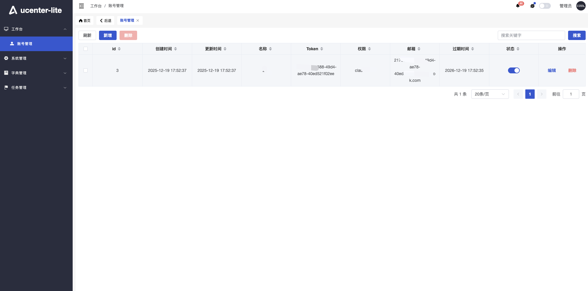
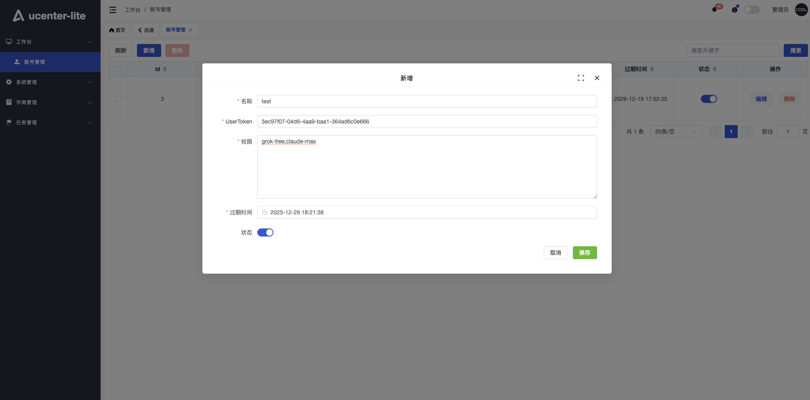

# xyhelper-ucenter-lite服务

  - ucenter 用户中心 lite 版是为需要快速集成 share 登录认证、且无其他复杂需求的用户提供的简易认证服务演示版本
  - 支持二次开发，帮助用户便捷部署和扩展认证功能
  - 基于 Go 语言开发，代码开源

## 部署

- 服务器要求
  - 至少2核2G内存(x86架构)
  - 10G硬盘
  - Ubuntu 22.04+
  - 已安装 Docker 和 Docker-Compose
  - 服务器已安装curl和git

### 一键部署脚本
```bash
bash <(curl -sSfL https://raw.githubusercontent.com/xyhelper/xyhelper-ucenter-lite-deploy/master/quick-install.sh | bash)
```

### 手动部署
- 克隆仓库到服务器上
```bash
bash <(git clone --depth=1 https://github.com/xyhelper/xyhelper-ucenter-lite-deploy.git xyhelper-ucenter-lite)
```
- 进入目录
```bash
bash <(cd xyhelper-ucenter-lite)
```
- 启动服务
```bash
bash <(./deploy.sh)
```

### 配置文件

#### docker-compose.yml文件

在xyhelper-ucenter-lite目录下，有一个docker-compose.yml文件，找到这个文件并打开，找到backend部分

```docker-compose.yml
# docker-compose.yml文件内容示例
services:

  backend:
    image: ghcr.io/xyhelper/xyhelper-ucenter-lite
    ports:
      - "9100:8001"                 #服务端口
    environment:
      - TZ=Asia/Shanghai
      - JWT_SECRET_KEY=            #子应用JWT token秘钥
      - EMAIL_SUFFIX=              #邮箱后缀，不填默认outlook.com
    volumes:
      - ./backend/manifest:/app/manifest
      - ./config/config.yaml:/app/config.yaml   #config.yaml配置文件
    restart: unless-stopped
...
```

#### docker-compose.yml配置说明

!> **注意**: docker-compose.yml文件除以下配置外，其余无需变动.

- 服务端口
  - 9100：服务部署的对外端口，保证服务器的9100端口没有被占用，也可自定义成其他端口
  - 8001：docker容器中服务的端口，无需改动
- JWT_SECRET_KEY
  - jwt密钥
  - 服务使用该密钥对access_token进行加密，以便claude-share服务解析关键参数
  - 该密钥保持与share配置文件中的APPJWTSECRETKEY保持一致
- EMAIL_SUFFIX
  - 用户邮箱后缀名，用户token加邮箱后缀为用户邮箱，用于share服务区分用户，跨车会话等唯一属性校验
  - 可不填，默认后缀outlook.com，无需"@"符号，该服务自行拼接
  - 例如：
       - -EMAIL_SUFFIX=outlook.com

### 启动/更新服务
```bash
cd xyhelper-ucenter-lite
./deploy.sh
```
### 查看日志
```bash
cd xyhelper-ucenter-lite
docker-compose logs -f --tail=100
```
### 停止服务
```bash
cd xyhelper-ucenter-lite
docker-compose down
```
### 重启服务
```bash
cd xyhelper-ucenter-lite
docker-compose restart
```

## 使用

### 后台管理
- 登录
  - xyhelper-ucenter-lite部署成功之后，访问：http://yourdomain/xyhelper, 访问后端管理地址，初始账号密码：admin/123456
  
- 工作台-账号管理
  - 账号管理
  
  - 属性说明
    - 名称：用户昵称
    - Token：用户登录token，保证唯一，ucenter-lite与share服务部署后，进去share选车页面，选择车辆,点击访问
      
    - 页面会跳转到ucenter-lite登录页面，输入该Token即可登录
      
    - 权限：根据用户服务填写权限，多个权限用英文逗号隔开，权限符合share的权限赋值标准
      - claude-share-server服务：
        - 免费服务以claude-free开头，后面参数可自行填写，例如claude-free-xxx
        - pro服务以claude-pro开头，后面参数可自行填写，例如claude-pro-xxx
        - max服务以claude-max开头，后面参数可自行填写，例如claude-max-xxx
      - grok-share-server服务：
        - 免费服务以grok-free开头，后面参数可自行填写，例如grok-free-xxx
        - Heavy服务grok-heavy开头，后面参数可自行填写，例如grok-heavy-xxx
        - SuperGrok服务以grok-superGrok开头，后面参数可自行填写，例如grok-superGrok-xxx
    
    - 邮箱：根据环境变量配置的邮箱后缀和token自动生成，邮箱在share跨车会话时使用，很重要，保证token唯一
    - 过期时间：账号过期时间