# ucenter 用户中心服务

这是一个用 Go 编写的用户中心服务，主要用于第三方应用接入，用户统一登录认证、统一支付接入、服务商品统一管理的服务。

## 功能特性
- **项目类型**: 免费不开源
- **用户统一认证**：支持通过 OAuth 2.0 或 OpenID Connect（OIDC）协议，实现第三方应用的用户统一登录认证对接
- **支付接入**：支持微信支付（V3）和支付宝支付的无缝集成
- **易支付支付接入**：兼容标准易支付接口，便于第三方应用快速对接支付功能
- **应用管理**：集中管理所有接入的第三方应用，提升接入效率与安全性
- **服务商品管理**：灵活配置和管理各类服务商品，满足多样化业务需求
- **订单管理**：统一管理第三方应用的订单，支持多渠道支付与订单追踪
- **商户管理**：完善的易支付商户管理体系，支持商户信息和密钥的集中维护
- 项目地址: [https://github.com/xyhelper/xyucenter-deploy](https://github.com/xyhelper/xyucenter-deploy)

## 部署

- 服务器要求
  - 至少2核2G内存(x86架构)
  - 10G硬盘
  - Ubuntu 22.04+
  - 已安装 Docker 和 Docker-Compose
  - 服务器已安装curl和git

### 一键部署脚本
```bash
bash <(curl -sSfL https://raw.githubusercontent.com/xyhelper/xycenter-deploy/master/quick-install.sh | bash)
```

### 手动部署
- 克隆仓库到服务器上
```bash
bash <(git clone --depth=1 https://github.com/xyhelper/xyucenter-deploy.git xyucenter-backend)
```
- 进入目录
```bash
bash <(cd xyucenter-backend)
```
- 启动服务
```bash
bash <(./deploy.sh)
```

### 配置文件

#### docker-compose.yml文件

在xyucenter-backend目录下，有一个docker-compose.yml文件，找到这个文件并打开，找到backend部分

```docker-compose.yml
# docker-compose.yml文件内容示例
services:

  backend:
    image: ghcr.io/xyhelper/xyucenter
    ports:
      - "8600:8001"                             #服务端口
    environment:
      - TZ=Asia/Shanghai
      - AUTH_DOMAIN=                            #oauth 域名
      - AUTH_CLIENT_ID=                         #oauth 客户端ID
      - AUTH_CLIENT_SECRET=                     #oauth 客户端密钥
      - AUTH_CALLBACK_URL=                      #服务地址
      - BILL_COMPANY_NAME=                      #账单中的公司名称
      - BILL_COMPANY_ADDRESS=                   #账单中的公司地址
      - JWT_SECRET_KEY=                         #jwt密钥
    volumes:
      - ./manifest:/app/manifest
      - ./certs:/app/certs                      # 支付证书路径
      - ./config/config.yaml:/app/config.yaml
    restart: unless-stopped
...
```

#### docker-compose.yml配置说明

!> **注意**: docker-compose.yml文件除以下配置外，其余无需变动.

- 服务端口
  - 8600：服务部署的对外端口，保证服务器的8600端口没有被占用，也可自定义成其他端口
  - 8001：docker容器中服务的端口，无需改动
- oauth域名、oauth客户端ID、oauth客户端秘钥
  - 支持oauth协议的身份认证与授权服务平台，例如：auth0（https://auth0.com） 或者 authorizer（https://authorizer.dev） 
  - auth0和authorizer获取AUTH_DOMAIN、AUTH_CLIENT_ID、AUTH_CLIENT_SECRET，请查看部署-auth0和部署-authorizer章节
  - 根据身份认证服务授权平台配置手册进行配置
  - 配置完身份认证服务授权平台之后获取平台的域名、客户端id和客户端秘钥设置到AUTH_DOMAIN、AUTH_CLIENT_ID、AUTH_CLIENT_SECRET
  - 例如：
       - -AUTH_DOMAIN=oauthdomain.com
       - -AUTH_DOMAIN=oauth-client-id
       - -AUTH_DOMAIN=oauth-client-secret
- 服务地址
  - 该项目部署完成之后的服务地址，主要用于回调，例如：https://yourdomain.com， 设置到AUTH_CALLBACK_URL
  - 例如：
       - -AUTH_CALLBACK_URL=https://yourdomain.com
- 账单中的公司名称、公司地址
  - 支付订单生成的账单中的公司名称和地址，根据自己具体情况填写到BILL_COMPANY_NAME和BILL_COMPANY_ADDRESS
  - 例如：
       - -BILL_COMPANY_NAME=XX科技公司
       - -BILL_COMPANY_NAME=XX市XX区XX街道
- jwt密钥
  - 自行定义的jwt密钥，根据自己定义情况填写到JWT_SECRET_KEY
  - 例如：
       - -JWT_SECRET_KEY=XXX
- 支付证书路径
  - 默认不修改，如使用默认值，请在xyucenter-backend目录下，新建文件夹certs
  - 若修改成其他路径，请在xyucenter-backend目录下的对应目录创建新的文件夹
  - 例如：
       - 修改成：- ./payment/certs/:/app/certs
       - 则在xyucenter-backend目录创建payment文件夹，在payment文件夹下创建certs文件夹
  - 支付路径设置完成，需配置支付证书（目前支持微信（V3）支付、支付宝支付）
       - 在支付证书路径（certs/或自定路径下），创建两个两个文件夹：alipay和wechatpay
       - alipay文件夹设置阿里支付的支付私钥和支付公钥，并转换成PEM格式文件，存储成单独的private_key.pem文件和public_key.pem文件
       - wechatpay文件夹设置微信支付V3版本的微信支付平台证书和支付私钥，并转换成PEM格式文件，存储成单独的cert.pem文件和private_key.pem文件
       - 配置完成的目录结构，例如：
        - certs/alipay/private_key.pem
        - certs/alipay/public_key.pem
        - certs/wechatpay/cert.pem
        - certs/wechatpay/private_key.pem

#### config.yaml配置文件              

在xyucenter-backend目录下，找到config文件夹，文件夹下有config.yml文件，打开找到wechat_pay和alipay_pay部分

```config.yml
# config.yml文件内容示例
...
wechat_pay:
  app_id: ""
  mch_id: ""
  mch_api_v3_key: ""
  serial_no: "" 
  private_key: ""  # 商户api私钥文件路径
  notify_url: "服务地址/api/v1/payment/wechat/callback" # 回调地址

alipay_pay:
  app_id: ""
  private_key: ""
  public_key: ""
  notify_url: "服务地址/api/v1/payment/alipay/callback" # 回调地址
  return_url: "服务地址/xyucenter/#/userOrders" # 支付成功跳转页面
  gateway_url: "https://openapi.alipay.com/gateway.do" # 网关地址
...
```

#### config.yaml配置说明  

!> **注意**: config.yaml文件除以下配置外，其余无需变动.

- wechat_pay支付配置（微信支付配置）
  - app_id：应用AppID
  - mch_id：商户号
  - mch_api_v3_key：API V3密钥
  - serial_no：商户API证书序列号
  - private_key：商户API私钥文件路径（docker-compose.yml文件中配置的certs路径下的wechatpay路径中的微信支付私钥路径，例如：certs/wechatpay/private_key.pem）
  - notify_url：ucenter的微信支付回调接口地址，根据服务部署地址配置，例如：https://yourdomain.com/api/v1/payment/wechat/callback， 其中"/api/v1/payment/wechat/callback"是接口地址，只需要将https://yourdomain.com 换成服务部署的地址
- alipay_pay支付配置（阿里支付配置）
  - app_id：应用ID
  - private_key：商户私钥（docker-compose.yml文件中配置的certs路径下的alipay路径中的支付宝支付私钥路径，例如：certs/alipay/private_key.pem）
  - public_key：支付宝公钥(docker-compose.yml文件中配置的certs路径下的alipay路径中的支付宝支付公钥路径，例如：certs/alipay/public_key.pem)
  - notify_url：ucenter的支付宝支付回调地址，根据服务部署地址配置，例如：https://yourdomain.com/api/v1/payment/alipay/callback， 其中"/api/v1/payment/alipay/callback"是接口地址，只需要将https://yourdomain.com 换成服务部署的地址
  - return_url：ucenter的支付宝支付成功跳转页面，根据服务部署地址配置，例如：https://yourdomain.com/xyucenter/#/userOrders， 其中"/xyucenter/#/userOrders"是页面跳转路由，只需要将https://yourdomain.com 换成服务部署的地址
  - gateway_url：支付宝网关地址，填入"https://openapi.alipay.com/gateway.do"， 固定不变

- 完整的配置，例如：

```config.yml
# config.yml文件内容示例
...
wechat_pay:
  app_id: "wxb******ddb"
  mch_id: "16******352"
  mch_api_v3_key: "mPjkM******Ph1wRM0m"
  serial_no: "404FD4661******AB3440D42F" 
  private_key: "certs/wechatpay/private_key.pem"  # 商户api私钥文件路径
  notify_url: "https://******/api/v1/payment/wechat/callback" # 回调地址

alipay_pay:
  app_id: "2021******675020"
  private_key: "certs/alipay/private_key.pem"
  public_key: "certs/alipay/public_key.pem"
  notify_url: "https://******/api/v1/payment/alipay/callback" # 回调地址
  return_url: "https://******/xyucenter/#/userOrders" # 支付成功跳转页面
  gateway_url: "https://openapi.alipay.com/gateway.do" # 网关地址
...
```

### auth0平台配置

- 访问官网：https://auth0.com 地址，注册并登录
- 登录之后，在左侧菜单栏中找到Applications菜单,如下图：
  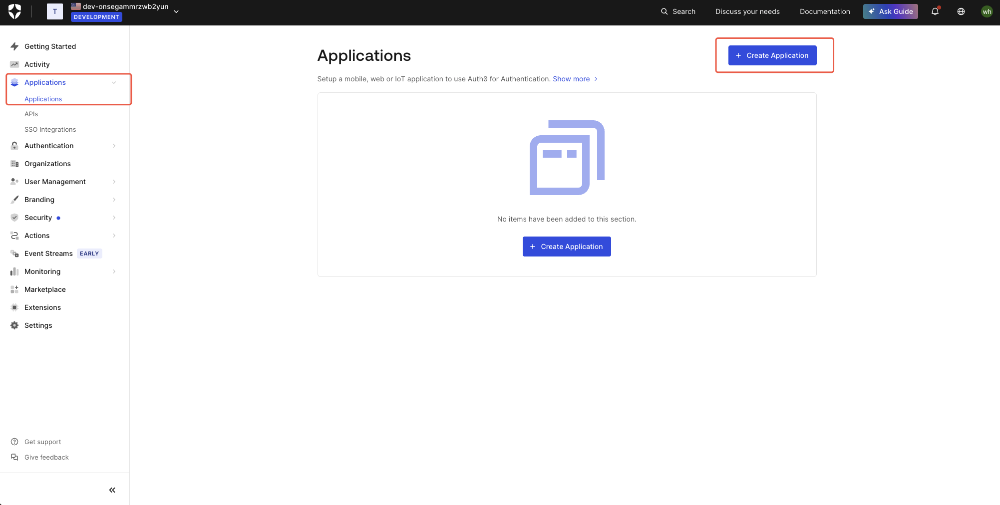
- 点击"Create Application"按钮，创建应用，填写应用名称（根据具体应用自定义名称），选择"Native"应用，点击"Create"进行创建
  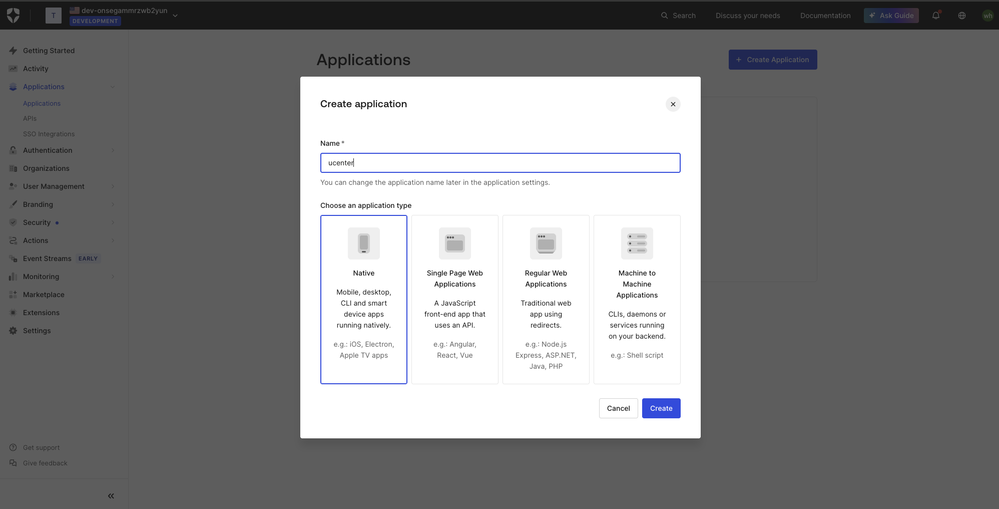
- 选择"Setting"页签，可以看到该应用的基本信息，包括Domain、Client ID、Client Secret等
  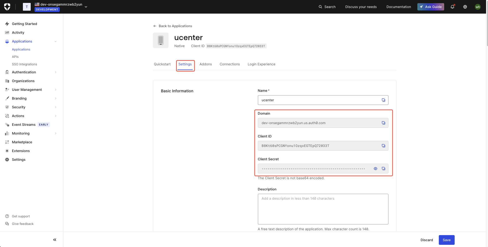
- 复制Domain、Client ID、Client Secret即上文docker-compose.yml配置文件中需要的AUTH_DOMAIN、AUTH_CLIENT_ID、AUTH_CLIENT_SECRET
- 在"Setting"页签中下拉，找到Application URIs模块，设置Allowed Callback URLs和Allowed Logout URLs（不设置则无法加载登录页面）设置用户中心服务的回调地址，该服务有两个回调地址，https://yourdomain/api/v1/center/getToken, 和  https://yourdomain/oauth/callback， 把yourdomain换成用户中心部署的服务地址，两个地址用英文逗号隔开，填写到Allowed Callback URLs和Allowed Logout URLs中,然后保存
  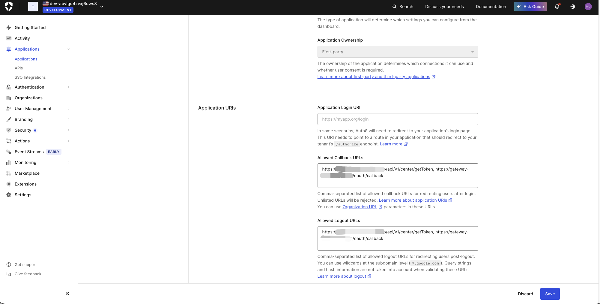
- 在"Connections"页签中，选择开启允许使用的社交登录方式
  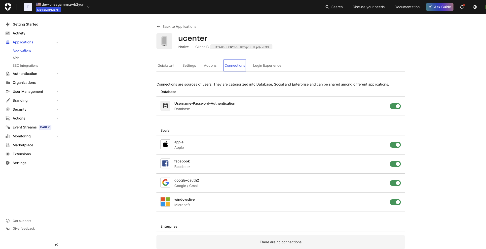
- 如果仅使用auth0的社交登录方式，则以上设置完成即可，如需其他功能，请查看auth0的官方文档

### authorizer平台配置

- 访问官网：https://authorizer.dev 地址
  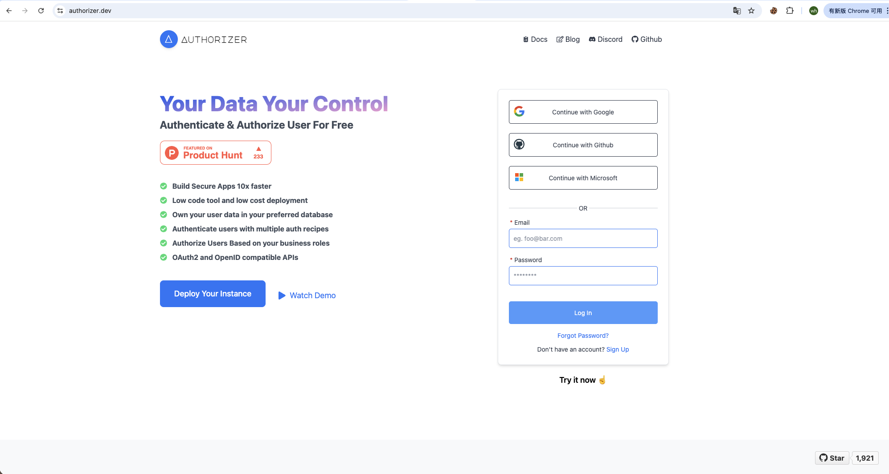
- 选择上方：Docs，跳转到文档页面，选择Getting Started，下拉到部署部分
  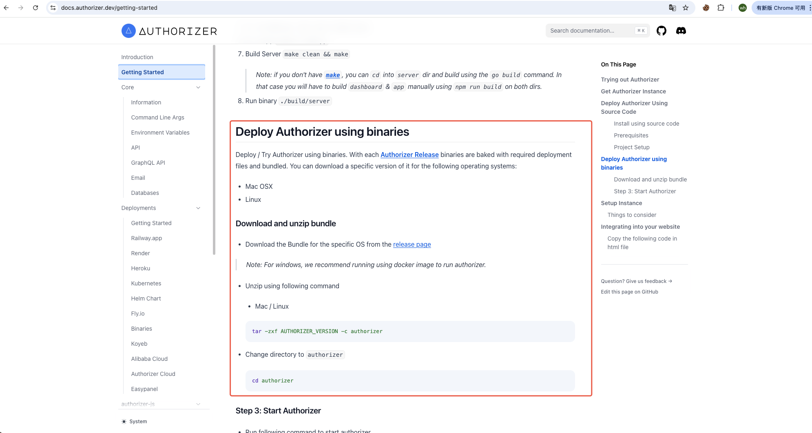
- 点击release page，页面跳转到github的安装包下载页面，选择合适的安装包，上传到服务器
  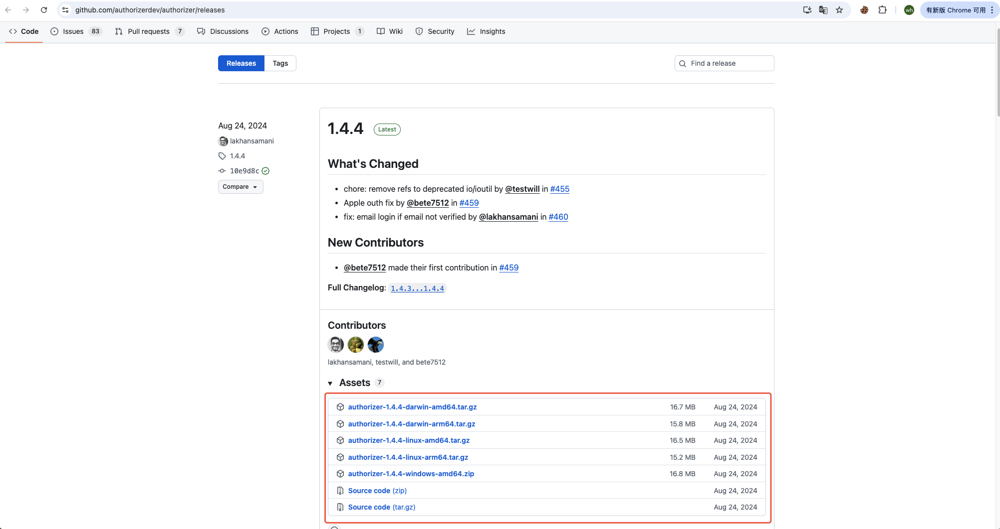
- 解压安装包，例如这里下载的authorizer-1.4.4-linux-amd64.tar.gz
  解压命令：tar -zxf AUTHORIZER_VERSION -c authorizer
  进入到解压文件夹：cd authorizer
- 在解压后的文件夹中找到.env文件,如果没有创建一个.env的文件，内容如下：
```.env
# .env文件内容示例
ENV=production
DATABASE_URL=data.db
DATABASE_TYPE=sqlite
CUSTOM_ACCESS_TOKEN_SCRIPT="function(user,tokenPayload){var data = tokenPayload;data.extra = {'x-extra-id': user.id};return data;}"
DISABLE_PLAYGROUND=false
ADMIN_SECRET=123456
PORT=80
```
- .env文件说明
  - ADMIN_SECRET=123456：部署之后管理员登录密码
  - PORT=80，服务部署端口号
  - 只需修改上面两个参数，其他无需修改
- 项目部署要使用域名，访问管理端时，一定要用域名访问，否则获取不到ClientID
- 启动项目命令：./build/server
- 项目启动之后，访问你的部署地址，例如：https://yourdomain ,出现登录页面
  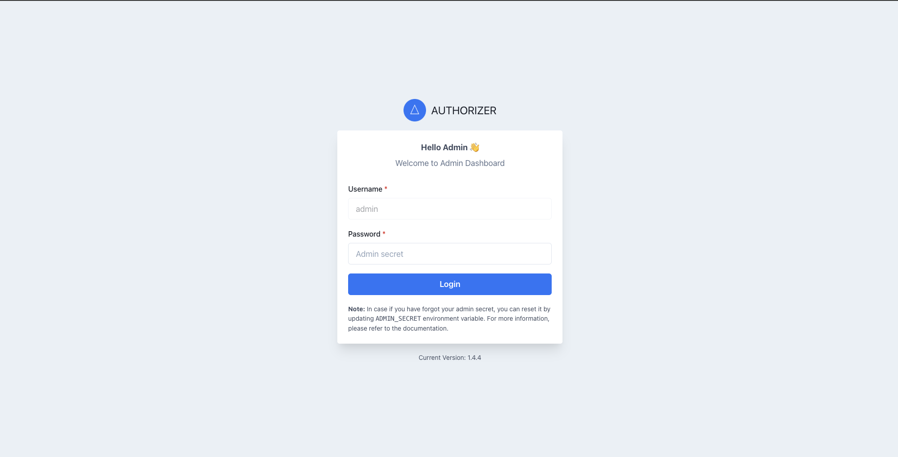
- 登录项目，使用.env中配置的密码
  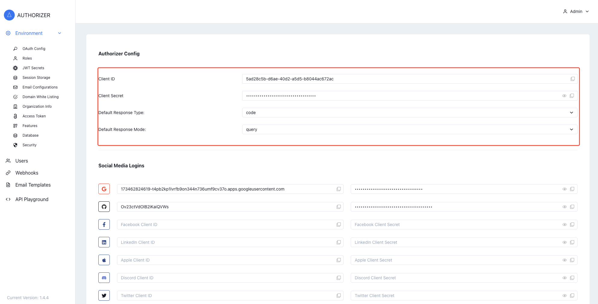
- 登录成功之后，选择左侧Environment目录的OAuth Config菜单，Authorizer Config配置说明
  - Client ID即上文docker-compose.yml配置文件中需要的AUTH_CLIENT_ID
  - Client Secret即上文docker-compose.yml配置文件中需要的AUTH_CLIENT_SECRET
  - authorizer部署域名（域名即：yourdomain，不需携带http或https）是上文docker-compose.yml配置文件中需要的AUTH_DOMAIN
  - Authorizer Config 配置中Default Response Type选择code，Default Response Mode选择query
- 如果需要社交媒体登录，则去相应的社交媒体获取Client ID和Secret填写到 OAuth Config菜单中的Social Media Logins，社交媒体各自获取过程不在详细介绍
- 邮箱配置，选择左侧菜单Environment中的Email Configurations配置邮箱的SMTP服务，填写SMTP Host、SMTP Port、SMTP Username、SMTP Password、From Email参数并保存
  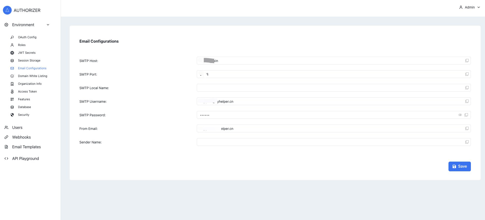
- 选择左侧菜单Environment中的Features进行登录配置，根据需要选择配置，注意可关闭Mobile Basic Authentication，目前不支持手机号验证身份
  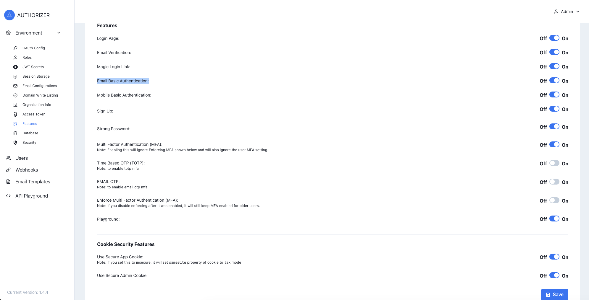
- 选择Magic Login Link开启，则启用邮箱链接登录，无需输入密码
- 选择合适的登录验证方式，点击下面的"Save",保存配置
- 按照上文描述将Client ID、Client Secret、authorizer部署地址设置到ucenter的配置文件中，则ucenter可使用authorizer登录
- 如需使用authorizer的其他功能，请查看官方文档

### 启动/更新服务
```bash
cd xyucenter-backend
./deploy.sh
```
### 查看日志
```bash
cd xyucenter-backend
docker-compose logs -f --tail=100
```
### 停止服务
```bash
cd xyucenter-backend
docker-compose down
```
### 重启服务
```bash
cd xyucenter-backend
docker-compose restart
```

## 使用

### 后台管理

- 登录
  - ucenter部署成功之后，访问：http://yourdomain/xyhelper, 访问后端管理地址，初始账号密码：admin/123456
    
- 工作台-用户管理
  - 用户列表：通过ucenter用户中心注册登录的用户列表
  - 余额流水：通过ucenter用户中心注册登录的用户余额流水
  - 余额流水：通过ucenter用户中心注册登录的用户订购的商品服务（不包含免费服务）
- 工作台-应用管理
  - 应用列表：对接到ucenter用户中心的应用列表
  - 创建应用之后，从这里获取子应用的Client ID和Client Secret，在子应用对接ucenter时使用
  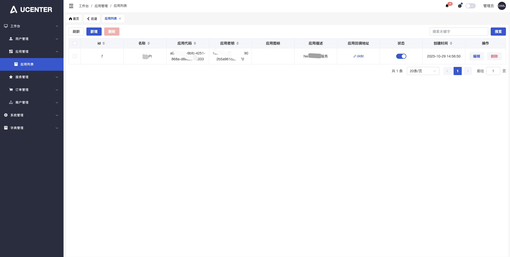
  - 例如，我们的claude-share-server和grok-share-server服务，都需要在这里创建子应用之后，获取到Client ID和Client Secret，在单独部署claude-share-server和grok-share-server服务使用，具体单独部署claude-share-server和grok-share-server服务步骤可参照各自服务部署步骤参数添加
- 工作台-服务管理
  - 服务列表：子应用中可以购买的商品服务，包括付费服务和免费服务，需要在这里设置
  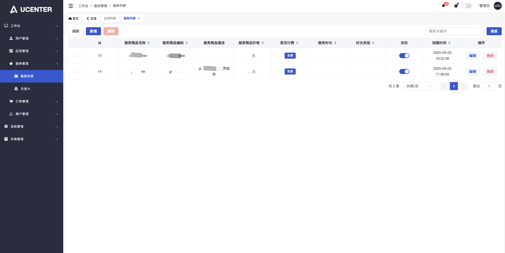
  - 服务编码配置规则：已经集成到ucenter的claude-share-server和grok-share-server的服务商品编码规则如下
    - claude-share-server服务：
      - 免费服务以claude-free开头，后面参数可自行填写，例如claude-free-xxx
      - pro服务以claude-pro开头，后面参数可自行填写，例如claude-pro-xxx
      - max服务以claude-max开头，后面参数可自行填写，例如claude-max-xxx
    - grok-share-server服务：
      - 免费服务以grok-free开头，后面参数可自行填写，例如grok-free-xxx
      - Heavy服务grok-heavy开头，后面参数可自行填写，例如grok-heavy-xxx
      - SuperGrok服务以grok-superGrok开头，后面参数可自行填写，例如grok-superGrok-xxx
  - 充值卡：子应用中可以兑换余额的充值卡设置
  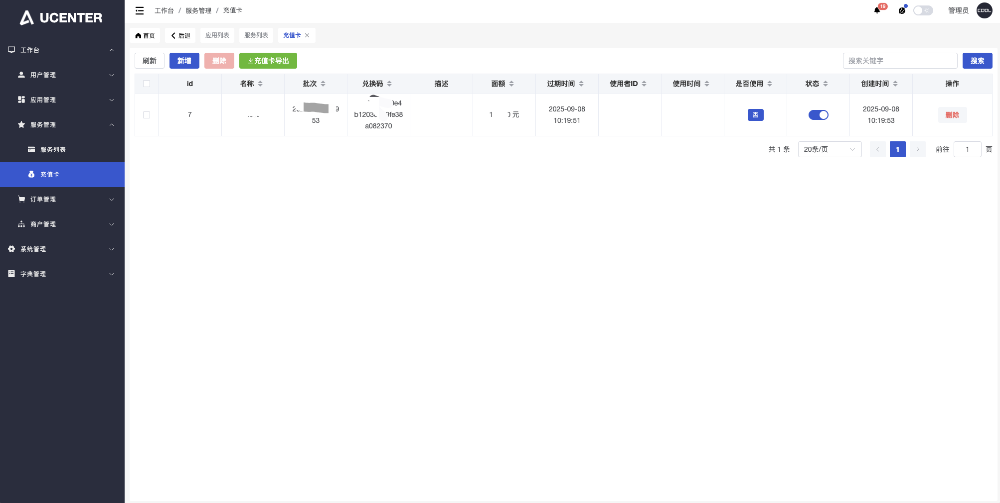
- 工作台-订单管理
  - 订单列表：子应用用户下单的订单列表
  - 支付方式：用户下单支付当时，支持：余额、微信、支付宝，请根据需要自行设置
    - 余额支付请填写支付方式编码：balance
    - 微信支付请填写支付方式编码：wechatPay
    - 余额支付请填写支付方式编码：alipay
- 工作台-商户管理
  - 该功能为：管理通过易支付标准接口对接到ucenter用户中心的商户功能，可在商户列表创建支付商户和商户密钥，将支付功能通过标准易支付接口对接到ucenter
  - 商户列表：管理易支付对接商户
  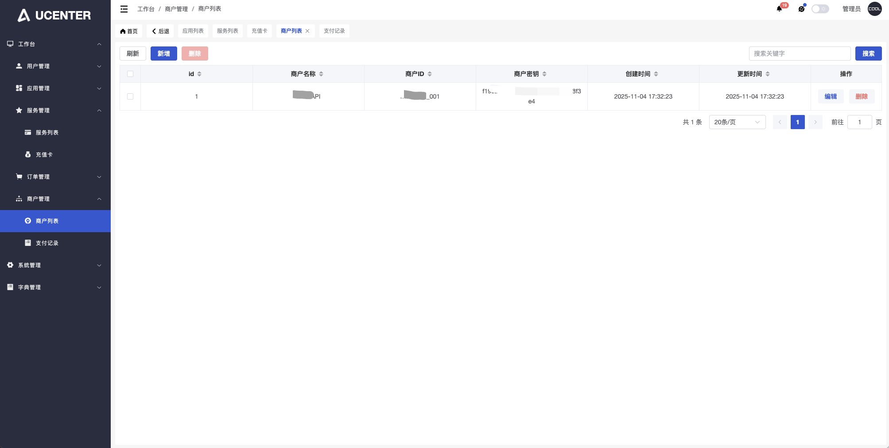
  - 支付记录：易支付商户进行的支付记录

### 用户订购系统

- ucenter部署成功之后，访问：http://yourdomain/xyucenter, 访问用户订购系统
- 登录方式会根据ucenter配置的oauth登录方式进行登录，登录成功后如下
  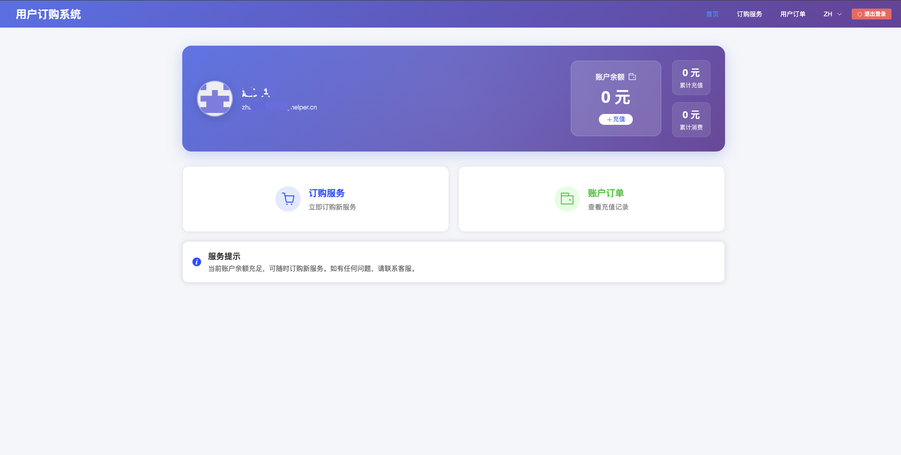
- 登录用户在该服务中自行订购服务，查看已订购的服务以及查看订单，账户余额等信息

## 第三方对接接口

### OAuth协议接口

- ucenter服务提供OAuth协议对接接口，对第三方符合OAuth协议的应用可以通过以下接口对接到ucenter服务中，具体查看下方接口文档
  - Well-Known配置
    - 接口地址：https://yourdomain/.well-known/openid-configuration
    - 请求方式：get
  - 授权接口
    - 接口地址：https://yourdomain/authorize
    - 请求方式：get
    - 请求参数：
      - client_id：               应用id，必填，string，在上文"工作台-应用管理"中注册获取
      - redirect_uri：            回调地址，必填，string，你的应用回调地址
      - response_type：           授权类型参数，必填，string，支持code（授权码）
      - scope：                   授权范围，必填，string，支持openid email profile
      - prompt：                  登录提示，选填，string
      - state：                   状态参数，string，主要用于防止 CSRF 攻击和保持请求的上下文，如果你的系统没有特殊安全需求，可以不必填，但建议保留，提升安全性和兼容性
    - 请求响应：用户访问授权接口后，会自动跳转到配置的上文配置的身份认证服务（如 Auth0 或 Authorizer）的登录页面，完成登录和授权流程。授权成功后，系统会根据 redirect_uri 参数回调到第三方应用指定的地址，并携带授权码等相关参数
  - 令牌端点接口
    - 接口地址：https://yourdomain/oauth/token
    - 请求方式：post
    - 请求参数：
      - code：               授权码，必填，string，/authorize授权后，从系统回调地址redirect_uri中获取
      - client_id：          应用id，必填，string，在上文"工作台-应用管理"中注册获取，用于校验应用是否在ucenter中注册
      - client_secret：      应用密钥，必填，string，在上文"工作台-应用管理"中注册获取，用于校验应用是否在ucenter中注册
    - 请求响应：
      - access_token：              访问令牌
      - refresh_token：             刷新令牌
      - expires_in：                访问令牌过期时间
      - refresh_expires_in：        刷新令牌过期时间
      - token_type：                令牌类型
  - 获取用户信息接口
    - 接口地址：https://yourdomain/oauth/userinfo
    - 请求方式：get
    - 请求参数：无，需在请求头 Authorization 中携带 access_token，格式为 Bearer access_token，access_token从/oauth/token接口中获取
    - 请求响应：
      - sub：                   用户唯一标识
      - email：                 用户邮箱
      - name：                  用户名
      - preferred_username：    用户昵称
      - picture：               用户头像地址

### 易支付对接接口

- ucenter服务提供易支付格式支付接口对接，符合以下接口数据格式的第三方支付服务均可通过以下接口对接到ucenter服务中，具体可查看下方接口文档
  - 易支付支付接口
    - 接口地址：https://yourdomain/easy/pay
    - 请求方式：post
    - 请求参数：
      - pid：           商户id，必填，string，在上文"工作台-商户管理"中注册获取
      - type：          支付方式，必填，string，目前支持微信和支付宝支付，可选参数：wxpay、alipay，分别代表微信支付、支付宝支付
      - out_trade_no：  商户订单号，必填，string，保证独立唯一
      - name：          商品名称，必填，string
      - money：         支付金额，必填，string
      - device：        设备类型，必填，string
      - notify_url：    异步通知地址，必填，string，ucenter支付完成后，调用的子应用支付回调地址
      - return_url：    同步通知地址，必填，string，ucenter支付完成后，支付页面跳转的子应用地址
      - sign_type：     签名方式，必填，string，默认MD5
      - sign：          签名，必填，string，参数按照ASCII码升序排列之后的加密钥的签名，密钥从商户管理中获取
    - 请求响应：返回支付页面（HTML），用户发起请求后会自动跳转到支付页面完成支付，无需额外处理响应数据。
    - 注意：sign_type和sign不参与参数签名加密
  - 易支付回调（notify_url）接口
    - 接口地址：商户自定义的notify_url
    - 请求方式：get
    - 请求参数：
      - pid：           商户id，在上文"工作台-商户管理"中注册获取
      - type：          支付方式，目前支持微信和支付宝支付，可选参数：wxpay、alipay，分别代表微信支付、支付宝支付
      - out_trade_no：  商户订单号，保证独立唯一
      - name：          商品名称，
      - money：         支付金额，
      - device：        设备类型，
      - return_url：    同步通知地址，ucenter支付完成后，支付页面跳转的子应用地址
      - trade_status：  订单支付结果，TRADE_SUCCESS表示支付成功，TRADE_FAILED表示支付失败
      - sign_type：     签名方式，默认MD5
      - sign：          签名，参数按照ASCII码升序排列之后的加密钥的签名，密钥从商户管理中获取
    - 请求响应：无需给ucenter用户中心响应
    - 注意：sign_type和sign不参与参数签名加密，商户每次接收到回调时建议都进行验签，防止参数被篡改
  - 例如，开源项目New API（https://docs.newapi.pro）对接ucenter易支付配置
    - 在ucenter后台管理端创建商户，New API，获取到商户ID和商户密钥
    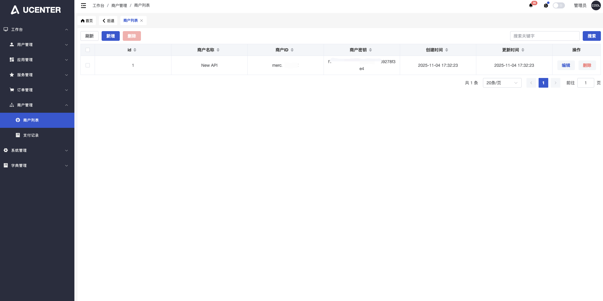
    - 登录New API项目，找到左侧菜单中系统设置，在系统设置中找到支付设置，
      - 易支付商户ID：上一步骤中在ucenter获取的商户ID
      - 易支付商户密钥：上一步骤中在ucenter获取的商户密钥
      - 支付地址：上文易支付对接接口中介绍的易支付支付接口地址，例如：https://yourdomain/easy/pay,
      - 回调地址：您服务器的部署地址，例如：https://yourdomain ，对于New API项目，他的notify_url是项目内部设置的，这里只填写您的服务器地址即可
      - 其他按照New API项目要求根据需要填写
    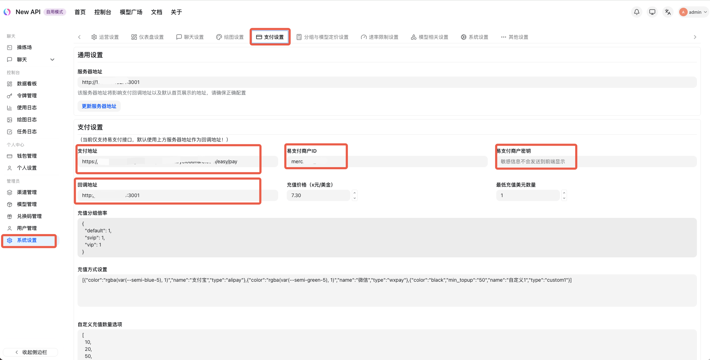
    - 保存设置之后，您部署的New API项目就可以通过易支付接口对接ucenter服务了